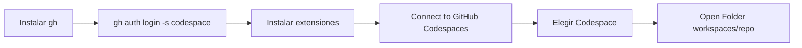

# Cursor + GitHub Codespaces — Guía general

_These instructions are also available in [English](./cursor-github-codespaces.md)._

Conecta **Cursor** a un **GitHub Codespace** para editar código y usar el agente en la nube, igual que en el navegador pero desde tu editor local.

Válido para **Windows**, **macOS** y **Linux**.

---

## Qué vas a lograr

- El editor y el **agente** ejecutan comandos **dentro** del Codespace (no en una carpeta local vacía).
- Cambias de ejercicio o repositorio eligiendo otro Codespace desde la extensión.



---

## Requisitos

- Cuenta de GitHub con acceso a **Codespaces**
- [GitHub CLI](https://cli.github.com/) (`gh`)
- [Cursor](https://cursor.com/)
- Extensión **Remote - SSH**
- Extensión **GitHub Codespaces Connector** (autor: **SmartManoj**)

---

## Parte A — Instalación (una sola vez)

### 1. Instalar GitHub CLI

| Sistema   | Cómo instalar |
|-----------|---------------|
| Windows   | Instalador desde [cli.github.com](https://cli.github.com/). Usa **Git Bash** o PowerShell donde `gh` esté en el PATH. |
| macOS     | `brew install gh` o el instalador de la web. |
| Linux     | Paquete de tu distro o [instrucciones oficiales](https://github.com/cli/cli#installation). |

Comprueba en terminal:

```bash
gh --version
```

### 2. Autenticarse en GitHub

1. Ejecuta el siguiente comando en una terminal:

   ```bash
   gh auth login -s codespace
   ```

   El flag `-s codespace` da permiso para gestionar Codespaces.

2. Sigue el asistente interactivo en la terminal:
   - Elige **GitHub.com** como host.
   - Selecciona el método de autenticación recomendado HTTPS y navegador web.
   - Cuando el asistente te lo indique, abre el enlace en el navegador, inicia sesión y autoriza el acceso.

3. Verifica tu estado de autenticación:

   ```bash
   gh auth status
   ```

   Deberías ver que tienes permisos sobre **Codespaces**.

### 3. Instalar extensiones en Cursor

Instala estas dos extensiones desde el marketplace de Cursor:

| Extensión | Autor | Enlace |
|-----------|-------|--------|
| **Remote - SSH** | Microsoft / Cursor | Busca `Remote - SSH` en extensiones |
| **GitHub Codespaces Connector** | **SmartManoj** | [Marketplace](https://marketplace.visualstudio.com/items?itemName=SmartManoj.github-codespaces-connector) |

#### Confiar en el autor de la extensión

**GitHub Codespaces Connector** es una extensión de terceros publicada por **SmartManoj** (no es la extensión oficial de GitHub).

Al instalarla, Cursor puede mostrar un aviso para **confiar en el autor** o **aceptar la extensión**. Debes **aceptar / confirmar que confías en el autor** para que la extensión se instale y funcione correctamente.

---

## Parte B — Conectar a un Codespace (cada sesión)

### Paso 1 — Abrir el comando de conexión

1. Abre la paleta de comandos:
   - **Windows / Linux:** `Ctrl+Shift+P`
   - **macOS:** `Cmd+Shift+P`
2. Escribe y ejecuta: **`Connect to GitHub Codespaces`**

### Paso 2 — Elegir el Codespace

Aparecerá un menú con tus Codespaces disponibles. Selecciona el que corresponda al ejercicio o repositorio del curso.

### Paso 3 — Abrir la carpeta del proyecto

Cuando Cursor te pida elegir carpeta, abre:

```text
/workspaces/NOMBRE-DEL-REPOSITORIO
```

`NOMBRE-DEL-REPOSITORIO` es el nombre del repo en GitHub **sin** el prefijo `organizacion/`.

| Repositorio en GitHub              | Ruta en Open Folder              |
|------------------------------------|----------------------------------|
| `mi-org/curso-javascript`          | `/workspaces/curso-javascript`   |
| `usuario/proyecto-final`           | `/workspaces/proyecto-final`     |

No uses rutas de tu PC (`C:\...`, `/Users/...`) ni `/workspace` (singular) salvo que tu Codespace lo use explícitamente.

### Paso 4 — Comprobar la conexión

- La barra inferior debe indicar que estás conectado por **SSH**.
- La terminal integrada debe mostrar un prompt Linux y rutas bajo `/workspaces/`.

Ahí el **agente** trabaja dentro del Codespace.

---

## Cambiar de Codespace (curso con muchos repos)

1. Cierra la ventana remota de Cursor o desconecta SSH.
2. `Ctrl+Shift+P` / `Cmd+Shift+P` → **Connect to GitHub Codespaces**.
3. Elige el Codespace del nuevo ejercicio.
4. **Open Folder** → `/workspaces/NOMBRE-DEL-NUEVO-REPO`.

## Trucos y solución de problemas

| Problema | Solución |
|----------|----------|
| No aparece **Connect to GitHub Codespaces** | Instala **GitHub Codespaces Connector** (autor: **SmartManoj**) y confía en el autor si Cursor lo pide |
| Lista de Codespaces vacía | Ejecuta `gh auth login -s codespace` y comprueba con `gh codespace list` |
| `gh: command not found` | Instala el CLI o usa la terminal donde esté en el PATH (en Windows, Git Bash suele funcionar mejor que CMD) |
| Se abre ventana pero la carpeta está vacía | **Open Folder** → `/workspaces/nombre-del-repo` |
| La extensión no se instala | Acepta el aviso de **confiar en el autor** (SmartManoj) |

---

## Checklist

### Primera vez

```text
□ Instalar gh
□ gh auth login -s codespace
□ gh auth status
□ Instalar Remote-SSH
□ Instalar GitHub Codespaces Connector (SmartManoj) y aceptar confiar en el autor
```

### Cada sesión

```text
□ Ctrl+Shift+P → Connect to GitHub Codespaces
□ Elegir Codespace de la lista
□ Open Folder → /workspaces/NOMBRE-DEL-REPO
```

---

## Resumen en una frase

Instala y autentica `gh` con `-s codespace`, instala **GitHub Codespaces Connector** de **SmartManoj** (aceptando confiar en el autor), ejecuta **Connect to GitHub Codespaces**, elige tu Codespace y abre **`/workspaces/nombre-del-repositorio`**.

---

## Enlaces útiles

- [GitHub Codespaces Connector — Marketplace](https://marketplace.visualstudio.com/items?itemName=SmartManoj.github-codespaces-connector) (autor: **SmartManoj**)
- [Repositorio de la extensión](https://github.com/SmartManoj/GitHub-Codespaces-Connector)
- [GitHub CLI — manual de codespace](https://cli.github.com/manual/gh_codespace)
- [GitHub Codespaces — documentación](https://docs.github.com/en/codespaces)
