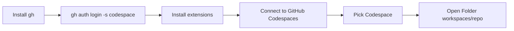

# Cursor + GitHub Codespaces — General Guide

_Estas instrucciones tambien estan disponibles en [espanol](./cursor-github-codespaces.es.md)._

Connect **Cursor** to a **GitHub Codespace** to edit code and use the agent in the cloud—the same experience as in the browser, but from your local editor.

Works on **Windows**, **macOS**, and **Linux**.

---

## What you will achieve

- The editor and **agent** run commands **inside** the Codespace (not in an empty local folder).
- Switch exercises or repositories by picking another Codespace from the extension.



---

## Requirements

- GitHub account with **Codespaces** access
- [GitHub CLI](https://cli.github.com/) (`gh`)
- [Cursor](https://cursor.com/)
- **Remote - SSH** extension
- **GitHub Codespaces Connector** extension (author: **SmartManoj**)

---

## Part A — One-time setup

### 1. Install GitHub CLI

| OS      | How to install |
|---------|----------------|
| Windows | Installer from [cli.github.com](https://cli.github.com/). Use **Git Bash** or PowerShell where `gh` is on your PATH. |
| macOS   | `brew install gh` or the web installer. |
| Linux   | Your distro package or [official instructions](https://github.com/cli/cli#installation). |

Verify in a terminal:

```bash
gh --version
```

### 2. Authenticate with GitHub

1. Run the following command in a terminal:

   ```bash
   gh auth login -s codespace
   ```

   The `-s codespace` flag grants permission to manage Codespaces.

2. Follow the interactive prompt in the terminal:
   - Choose **GitHub.com** as the host.
   - Select the recommended authentication method: HTTPS and web browser.
   - When prompted, open the link in your browser, sign in, and authorize access.

3. Verify your authentication status:

   ```bash
   gh auth status
   ```

   You should see **Codespaces** permissions listed.

### 3. Install extensions in Cursor

Install both extensions from the Cursor marketplace:

| Extension | Author | Link |
|-----------|--------|------|
| **Remote - SSH** | Microsoft / Cursor | Search for `Remote - SSH` in extensions |
| **GitHub Codespaces Connector** | **SmartManoj** | [Marketplace](https://marketplace.visualstudio.com/items?itemName=SmartManoj.github-codespaces-connector) |

#### Trust the extension author

**GitHub Codespaces Connector** is a third-party extension published by **SmartManoj** (it is not the official GitHub extension).

When installing, Cursor may show a prompt to **trust the author** or **accept the extension**. You must **accept / confirm that you trust the author** for the extension to install and work correctly.

---

## Part B — Connect to a Codespace (each session)

### Step 1 — Open the connect command

1. Open the command palette:
   - **Windows / Linux:** `Ctrl+Shift+P`
   - **macOS:** `Cmd+Shift+P`
2. Type and run: **`Connect to GitHub Codespaces`**

### Step 2 — Pick a Codespace

A menu will list your available Codespaces. Select the one for your current exercise or repository.

### Step 3 — Open the project folder

When Cursor asks you to pick a folder, open:

```text
/workspaces/REPOSITORY-NAME
```

`REPOSITORY-NAME` is the GitHub repo name **without** the `organization/` prefix.

| GitHub repository           | Open Folder path                |
|-----------------------------|---------------------------------|
| `my-org/javascript-course`  | `/workspaces/javascript-course` |
| `user/final-project`        | `/workspaces/final-project`     |

Do not use local PC paths (`C:\...`, `/Users/...`) or `/workspace` (singular) unless your Codespace explicitly uses that layout.

### Step 4 — Verify the connection

- The status bar should show an **SSH** connection.
- The integrated terminal should show a Linux prompt and paths under `/workspaces/`.

The **agent** runs inside the Codespace in this window.

---

## Switching Codespaces (courses with many repos)

1. Close the remote Cursor window or disconnect SSH.
2. `Ctrl+Shift+P` / `Cmd+Shift+P` → **Connect to GitHub Codespaces**.
3. Pick the Codespace for the new exercise.
4. **Open Folder** → `/workspaces/NEW-REPO-NAME`.

## Tips and troubleshooting

| Problem | Solution |
|---------|----------|
| **Connect to GitHub Codespaces** does not appear | Install **GitHub Codespaces Connector** (author: **SmartManoj**) and trust the author if Cursor prompts you |
| Empty Codespace list | Run `gh auth login -s codespace` and check with `gh codespace list` |
| `gh: command not found` | Install the CLI or use a terminal where it is on PATH (on Windows, Git Bash often works better than CMD) |
| Window opens but folder is empty | **Open Folder** → `/workspaces/repository-name` |
| Extension will not install | Accept the **trust the author** prompt (**SmartManoj**) |

---

## Checklist

### First time

```text
□ Install gh
□ gh auth login -s codespace
□ gh auth status
□ Install Remote-SSH
□ Install GitHub Codespaces Connector (SmartManoj) and accept trusting the author
```

### Each session

```text
□ Ctrl+Shift+P → Connect to GitHub Codespaces
□ Pick a Codespace from the list
□ Open Folder → /workspaces/REPOSITORY-NAME
```

---

## One-sentence summary

Install and authenticate `gh` with `-s codespace`, install **GitHub Codespaces Connector** by **SmartManoj** (accepting trust in the author), run **Connect to GitHub Codespaces**, pick your Codespace, and open **`/workspaces/repository-name`**.

---

## Useful links

- [GitHub Codespaces Connector — Marketplace](https://marketplace.visualstudio.com/items?itemName=SmartManoj.github-codespaces-connector) (author: **SmartManoj**)
- [Extension repository](https://github.com/SmartManoj/GitHub-Codespaces-Connector)
- [GitHub CLI — codespace manual](https://cli.github.com/manual/gh_codespace)
- [GitHub Codespaces documentation](https://docs.github.com/en/codespaces)
