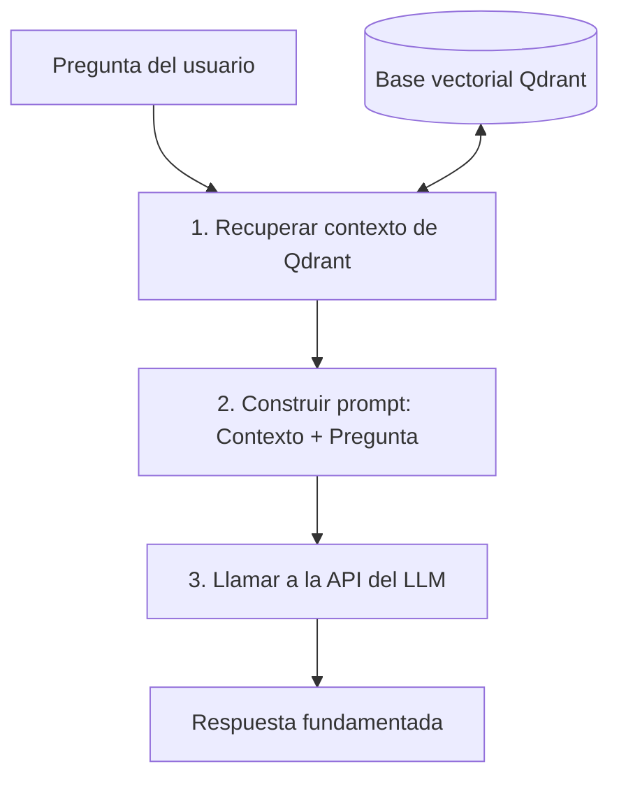

# Ejemplo: RAG desde cero con Python y Qdrant

<!-- hide -->

_Estas instrucciones también están disponibles en [inglés](./README.md)._

<!-- endhide -->

Construir un sistema de Retrieval-Augmented Generation (RAG) no siempre requiere frameworks complejos como LangChain o LlamaIndex. A veces, construirlo desde cero usando solo Python, una base de datos vectorial como Qdrant y llamadas directas a la API puede ser la mejor forma de entender la mecánica central del RAG.

En esta lección verás cómo se construye un pipeline RAG completamente funcional usando solo **Python** y **Qdrant**.

---

## 🎯 ¿Qué es RAG?

Los Large Language Models (LLM) son muy capaces, pero están congelados en el tiempo y no conocen archivos privados, documentos internos de la empresa ni información en tiempo real.

**Retrieval-Augmented Generation (RAG)** resuelve esto mediante:

1. **Recuperar** documentos relevantes de una fuente externa (una base de datos vectorial).
2. **Aumentar** tu prompt con esos documentos.
3. **Generar** una respuesta usando un LLM que ahora está "anclado" a tu contexto.



---

## 🛠️ Stack tecnológico

Para esta implementación usaremos:

- **Python**: Para escribir la lógica del pipeline.
- **Qdrant**: Una base de datos vectorial de alto rendimiento para almacenar embeddings de documentos y realizar búsqueda semántica.
- **Cliente HTTP genérico (`requests`)**: Para interactuar con el proveedor de embeddings y LLM que elijas (OpenAI, Anthropic, Mistral, Cohere, etc.) mediante variables de entorno.

---

## 🚀 Configuración del entorno

### Variables de entorno

Para mantener flexible el proveedor del modelo y evitar hardcodear secretos, leeremos la configuración desde variables de entorno:

```bash
export LLM_API_KEY="your-api-key-here"
export LLM_API_URL="https://api.openai.com/v1" # o cualquier gateway compatible
export LLM_MODEL="gpt-4o-mini" # o tu modelo de chat preferido
```

---

## 💻 Implementación paso a paso

### Paso 1: El modelo de embeddings (`embed`)

Un modelo de embeddings convierte texto en una lista de números (un vector/coordenada) donde palabras u oraciones con significados similares quedan cerca unas de otras en un espacio de alta dimensionalidad.

```python
import os
import requests

API_KEY = os.getenv("LLM_API_KEY")
API_URL = os.getenv("LLM_API_URL", "https://api.openai.com/v1")

def embed(text: str) -> list[float]:
    """Convert text into a vector using a generic embedding API."""
    if not API_KEY:
        raise ValueError("LLM_API_KEY environment variable is not set")

    headers = {
        "Authorization": f"Bearer {API_KEY}",
        "Content-Type": "application/json"
    }
    payload = {
        "model": "text-embedding-3-small", # generic embedding model
        "input": text
    }

    response = requests.post(f"{API_URL}/embeddings", json=payload, headers=headers)
    response.raise_for_status()

    return response.json()["data"][0]["embedding"]
```

---

### Paso 2: Indexación de documentos (`setup`)

Necesitamos poblar Qdrant con nuestra base de conocimiento. Definimos una lista de documentos, los embebemos y los guardamos como puntos en una **colección** de Qdrant junto con el texto original (payload).

```python
from qdrant_client import QdrantClient
from qdrant_client.models import Distance, VectorParams, PointStruct

client = QdrantClient(host="localhost", port=6333)
COLLECTION = "documents"

# Our knowledge base
documents = [
    "4Geeks Academy is a coding bootcamp with campuses in Miami and Spain.",
    "4Geeks courses cover Full Stack, Data Science, and AI Engineering.",
    "LearnPack is 4Geeks' interactive exercises platform.",
    "Rigobot is 4Geeks' AI tutor that guides students.",
]

def setup():
    """Create collection in Qdrant and index the documents."""
    collections = [c.name for c in client.get_collections().collections]

    if COLLECTION not in collections:
        # Standard OpenAI text-embedding-3-small yields vectors of size 1536
        client.create_collection(
            collection_name=COLLECTION,
            vectors_config=VectorParams(size=1536, distance=Distance.COSINE),
        )

        points = []
        for i, doc in enumerate(documents):
            vector = embed(doc)
            points.append(
                PointStruct(id=i, vector=vector, payload={"text": doc})
            )

        client.upsert(collection_name=COLLECTION, points=points)
        print("Collection created and documents indexed.")
```

---

### Paso 3: Recuperación (`retrieve`)

Cuando un usuario hace una pregunta, recuperamos los documentos coincidentes embebiendo la pregunta y buscando en Qdrant los vectores más cercanos usando similitud coseno.

```python
def retrieve(query: str, limit: int = 2) -> list[str]:
    """Find the most relevant document chunks based on query semantic similarity."""
    vector_query = embed(query)
    results = client.query_points(
        collection_name=COLLECTION,
        query=vector_query,
        limit=limit,
    )
    return [r.payload["text"] for r in results.points]
```

---

### Paso 4: Generación (`query`)

Esta función orquesta todo el pipeline. Toma la pregunta, recupera el mejor contexto de Qdrant, construye un prompt formateado que instruye al modelo a basarse solo en el contexto recuperado y solicita una respuesta al LLM.

```python
MODEL_NAME = os.getenv("LLM_MODEL", "gpt-4o-mini")

def query(user_query: str, limit: int = 2) -> dict:
    """Full RAG pipeline: retrieve context, then generate the final grounded answer."""
    # 1. Retrieve
    context_chunks = retrieve(user_query, limit=limit)
    context = "\n".join(context_chunks)

    # 2. Augment prompt
    prompt = (
        "Use the following context to answer the question. If you do not know the answer, "
        "or if the context doesn't contain it, honestly state that you don't know.\n\n"
        f"Context:\n{context}\n\n"
        f"Question: {user_query}\n"
        "Answer:"
    )

    # 3. Generate
    if not API_KEY:
        raise ValueError("LLM_API_KEY environment variable is not set")

    headers = {
        "Authorization": f"Bearer {API_KEY}",
        "Content-Type": "application/json"
    }
    payload = {
        "model": MODEL_NAME,
        "messages": [
            {"role": "system", "content": "You are a helpful and honest assistant."},
            {"role": "user", "content": prompt}
        ],
        "temperature": 0.0
    }

    response = requests.post(f"{API_URL}/chat/completions", json=payload, headers=headers)
    response.raise_for_status()

    answer = response.json()["choices"][0]["message"]["content"]

    return {
        "answer": answer,
        "context_used": context,
    }
```

---

## 📝 Script completo

Aquí tienes el código completo en un solo archivo (`rag.py`) para probar tu configuración fácilmente:

```python
"""
RAG Module: Retrieval-Augmented Generation with Qdrant.
"""

import os
import requests
from qdrant_client import QdrantClient
from qdrant_client.models import Distance, VectorParams, PointStruct

# Read LLM configuration from environment variables
API_KEY = os.getenv("LLM_API_KEY")
API_URL = os.getenv("LLM_API_URL", "https://api.openai.com/v1")
MODEL_NAME = os.getenv("LLM_MODEL", "gpt-4o-mini")

# Connect to Qdrant local instance
client = QdrantClient(host="localhost", port=6333)
COLLECTION = "documents"

# Knowledge base documents
documents = [
    "4Geeks Academy is a coding bootcamp with campuses in Miami and Spain.",
    "4Geeks courses cover Full Stack, Data Science, and AI Engineering.",
    "LearnPack is 4Geeks' interactive exercises platform.",
    "Rigobot is 4Geeks' AI tutor that guides students.",
]


def embed(text: str) -> list[float]:
    """Convert text to a vector so we can compare meaning, not just keywords."""
    if not API_KEY:
        raise ValueError("LLM_API_KEY environment variable is not set")

    headers = {
        "Authorization": f"Bearer {API_KEY}",
        "Content-Type": "application/json"
    }
    payload = {
        "model": "text-embedding-3-small",
        "input": text
    }

    response = requests.post(f"{API_URL}/embeddings", json=payload, headers=headers)
    response.raise_for_status()
    return response.json()["data"][0]["embedding"]


def setup():
    """Index documents into Qdrant on first run."""
    collections = [c.name for c in client.get_collections().collections]
    if COLLECTION not in collections:
        client.create_collection(
            collection_name=COLLECTION,
            vectors_config=VectorParams(size=1536, distance=Distance.COSINE),
        )
        points = [
            PointStruct(id=i, vector=embed(doc), payload={"text": doc})
            for i, doc in enumerate(documents)
        ]
        client.upsert(collection_name=COLLECTION, points=points)
        print("Collection created and indexed.")


def retrieve(query: str, limit: int = 2) -> list[str]:
    """Retrieval step: find the most relevant document chunks."""
    vector_query = embed(query)
    results = client.query_points(
        collection_name=COLLECTION,
        query=vector_query,
        limit=limit,
    )
    return [r.payload["text"] for r in results.points]


def query(user_query: str, limit: int = 2) -> dict:
    """Full RAG pipeline: retrieve context, then generate an answer."""
    context = "\n".join(retrieve(user_query, limit=limit))

    prompt = (
        "Use the following context to answer the question.\n\n"
        f"Context:\n{context}\n\n"
        f"Question: {user_query}\n"
        "Answer:"
    )

    if not API_KEY:
        raise ValueError("LLM_API_KEY environment variable is not set")

    headers = {
        "Authorization": f"Bearer {API_KEY}",
        "Content-Type": "application/json"
    }
    payload = {
        "model": MODEL_NAME,
        "messages": [{"role": "user", "content": prompt}],
        "temperature": 0.0
    }

    response = requests.post(f"{API_URL}/chat/completions", json=payload, headers=headers)
    response.raise_for_status()

    return {
        "answer": response.json()["choices"][0]["message"]["content"],
        "context_used": context,
    }


if __name__ == "__main__":
    # 1. Start Qdrant and index files
    setup()

    # 2. Query the database
    question = "Where are the 4Geeks Academy campuses?"
    print(f"\nQuestion: {question}")

    result = query(question)
    print(f"\nContext Used:\n{result['context_used']}")
    print(f"\nAnswer:\n{result['answer']}")
```

---

## 🎯 Conclusiones clave y buenas prácticas

1. **Coincidencia del tamaño del embedding**: La configuración de la colección (`VectorParams(size=1536)`) debe coincidir exactamente con las dimensiones del vector que devuelve tu API de embeddings elegida (por ejemplo, OpenAI `text-embedding-3-small` devuelve 1536).
2. **Idempotencia**: Si ejecutas `setup()` varias veces, usar IDs de punto deterministas (como nuestro `id=i` fijo) evita duplicar documentos porque Qdrant sobrescribe los puntos existentes con el mismo ID.
3. **Prevención de alucinaciones**: Instrucciones explícitas en el prompt que obligan al modelo a basarse solo en el contexto recuperado evitan que el LLM fabrique información falsa o saque datos obsoletos de su dataset de preentrenamiento general.

### ⚠️ Más allá: umbrales de similitud

En un sistema RAG listo para producción, simplemente consultar los $k$ documentos más cercanos no basta. Si un usuario hace una pregunta no relacionada (por ejemplo, "¿Cuál es la capital de Francia?"), la base de datos seguirá devolviendo los vectores más cercanos — aunque su puntuación de similitud sea extremadamente baja.

Para evitar alimentar contexto irrelevante al LLM, debes filtrar los resultados de búsqueda por puntuación:

```python
# Extract the search results with scores to inspect similarity
results = client.query_points(
    collection_name=COLLECTION,
    query=vector_query,
    limit=limit,
)

# Only keep chunks clearing a minimum similarity threshold (e.g., 0.7)
MIN_SCORE = 0.7
relevant_chunks = [
    r.payload["text"] for r in results.points
    if r.score >= MIN_SCORE
]
```

Si ningún documento supera el umbral, la lista de recuperación queda vacía, lo que lleva a tu LLM a responder honestamente: _"No tengo información sobre eso."_
