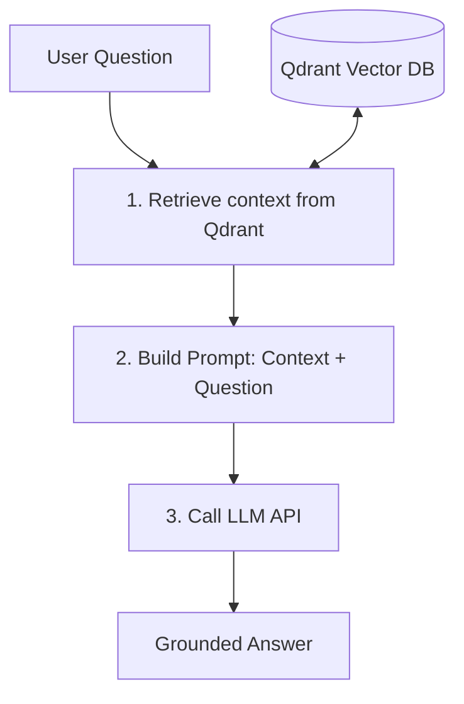

# Example: RAG from scratch with Python and Qdrant

<!-- hide -->

_These instructions are also available in [Spanish](./README.es.md)._

<!-- endhide -->

Building a Retrieval-Augmented Generation (RAG) system doesn't always require complex frameworks like LangChain or LlamaIndex. Sometimes, building it from scratch using only Python, a vector database like Qdrant, and direct API calls can be the best way to understand the core mechanics of RAG.

In this lesson, you will see how a fully functional RAG pipeline is build using only **Python** and **Qdrant**.

---

## 🎯 What is RAG?

Large Language Models (LLMs) are incredibly capable, but they are frozen in time and do not know about private files, internal company documents, or real-time information.

**Retrieval-Augmented Generation (RAG)** solves this by:

1. **Retrieving** relevant documents from an external source (a vector database).
2. **Augmenting** your prompt with those documents.
3. **Generating** an answer using an LLM that is now "grounded" in your context.



---

## 🛠️ The Tech Stack

For this implementation, we will use:

- **Python**: To write the pipeline logic.
- **Qdrant**: A high-performance vector database to store document embeddings and perform semantic search.
- **Generic HTTP Client (`requests`)**: To interact with your embedding and LLM provider of choice (OpenAI, Anthropic, Mistral, Cohere, etc.) via environment variables.

---

## 🚀 Setting Up the Environment

### Environment Variables

To keep our model provider flexible and avoid hardcoding secrets, we will read configuration from environment variables:

```bash
export LLM_API_KEY="your-api-key-here"
export LLM_API_URL="https://api.openai.com/v1" # or any compatible gateway
export LLM_MODEL="gpt-4o-mini" # or your preferred chat model
```

---

## 💻 Step-by-Step Implementation

### Step 1: The Embedding Model (`embed`)

An embedding model converts text into a list of numbers (a vector/coordinate) where words or sentences with similar meanings live close together in a high-dimensional space.

```python
import os
import requests

API_KEY = os.getenv("LLM_API_KEY")
API_URL = os.getenv("LLM_API_URL", "https://api.openai.com/v1")

def embed(text: str) -> list[float]:
    """Convert text into a vector using a generic embedding API."""
    if not API_KEY:
        raise ValueError("LLM_API_KEY environment variable is not set")

    headers = {
        "Authorization": f"Bearer {API_KEY}",
        "Content-Type": "application/json"
    }
    payload = {
        "model": "text-embedding-3-small", # generic embedding model
        "input": text
    }

    response = requests.post(f"{API_URL}/embeddings", json=payload, headers=headers)
    response.raise_for_status()

    return response.json()["data"][0]["embedding"]
```

---

### Step 2: Indexing Documents (`setup`)

We need to populate Qdrant with our knowledge base. We define a list of documents, embed them, and save them as points in a Qdrant **collection** along with the original text (payload).

```python
from qdrant_client import QdrantClient
from qdrant_client.models import Distance, VectorParams, PointStruct

client = QdrantClient(host="localhost", port=6333)
COLLECTION = "documents"

# Our knowledge base
documents = [
    "4Geeks Academy is a coding bootcamp with campuses in Miami and Spain.",
    "4Geeks courses cover Full Stack, Data Science, and AI Engineering.",
    "LearnPack is 4Geeks' interactive exercises platform.",
    "Rigobot is 4Geeks' AI tutor that guides students.",
]

def setup():
    """Create collection in Qdrant and index the documents."""
    collections = [c.name for c in client.get_collections().collections]

    if COLLECTION not in collections:
        # Standard OpenAI text-embedding-3-small yields vectors of size 1536
        client.create_collection(
            collection_name=COLLECTION,
            vectors_config=VectorParams(size=1536, distance=Distance.COSINE),
        )

        points = []
        for i, doc in enumerate(documents):
            vector = embed(doc)
            points.append(
                PointStruct(id=i, vector=vector, payload={"text": doc})
            )

        client.upsert(collection_name=COLLECTION, points=points)
        print("Collection created and documents indexed.")
```

---

### Step 3: Retrieval (`retrieve`)

When a user asks a question, we retrieve the matching documents by embedding the question and searching Qdrant for the closest vectors using cosine similarity.

```python
def retrieve(query: str, limit: int = 2) -> list[str]:
    """Find the most relevant document chunks based on query semantic similarity."""
    vector_query = embed(query)
    results = client.query_points(
        collection_name=COLLECTION,
        query=vector_query,
        limit=limit,
    )
    return [r.payload["text"] for r in results.points]
```

---

### Step 4: Generation (`query`)

This function orchestrates the whole pipeline. It takes the question, retrieves the best context from Qdrant, builds a formatted prompt instructing the model to rely only on the retrieved context, and requests an answer from the LLM.

```python
MODEL_NAME = os.getenv("LLM_MODEL", "gpt-4o-mini")

def query(user_query: str, limit: int = 2) -> dict:
    """Full RAG pipeline: retrieve context, then generate the final grounded answer."""
    # 1. Retrieve
    context_chunks = retrieve(user_query, limit=limit)
    context = "\n".join(context_chunks)

    # 2. Augment prompt
    prompt = (
        "Use the following context to answer the question. If you do not know the answer, "
        "or if the context doesn't contain it, honestly state that you don't know.\n\n"
        f"Context:\n{context}\n\n"
        f"Question: {user_query}\n"
        "Answer:"
    )

    # 3. Generate
    if not API_KEY:
        raise ValueError("LLM_API_KEY environment variable is not set")

    headers = {
        "Authorization": f"Bearer {API_KEY}",
        "Content-Type": "application/json"
    }
    payload = {
        "model": MODEL_NAME,
        "messages": [
            {"role": "system", "content": "You are a helpful and honest assistant."},
            {"role": "user", "content": prompt}
        ],
        "temperature": 0.0
    }

    response = requests.post(f"{API_URL}/chat/completions", json=payload, headers=headers)
    response.raise_for_status()

    answer = response.json()["choices"][0]["message"]["content"]

    return {
        "answer": answer,
        "context_used": context,
    }
```

---

## 📝 Complete Script

Here is the complete codebase in a single file (`rag.py`) to test your setup easily:

```python
"""
RAG Module: Retrieval-Augmented Generation with Qdrant.
"""

import os
import requests
from qdrant_client import QdrantClient
from qdrant_client.models import Distance, VectorParams, PointStruct

# Read LLM configuration from environment variables
API_KEY = os.getenv("LLM_API_KEY")
API_URL = os.getenv("LLM_API_URL", "https://api.openai.com/v1")
MODEL_NAME = os.getenv("LLM_MODEL", "gpt-4o-mini")

# Connect to Qdrant local instance
client = QdrantClient(host="localhost", port=6333)
COLLECTION = "documents"

# Knowledge base documents
documents = [
    "4Geeks Academy is a coding bootcamp with campuses in Miami and Spain.",
    "4Geeks courses cover Full Stack, Data Science, and AI Engineering.",
    "LearnPack is 4Geeks' interactive exercises platform.",
    "Rigobot is 4Geeks' AI tutor that guides students.",
]


def embed(text: str) -> list[float]:
    """Convert text to a vector so we can compare meaning, not just keywords."""
    if not API_KEY:
        raise ValueError("LLM_API_KEY environment variable is not set")

    headers = {
        "Authorization": f"Bearer {API_KEY}",
        "Content-Type": "application/json"
    }
    payload = {
        "model": "text-embedding-3-small",
        "input": text
    }

    response = requests.post(f"{API_URL}/embeddings", json=payload, headers=headers)
    response.raise_for_status()
    return response.json()["data"][0]["embedding"]


def setup():
    """Index documents into Qdrant on first run."""
    collections = [c.name for c in client.get_collections().collections]
    if COLLECTION not in collections:
        client.create_collection(
            collection_name=COLLECTION,
            vectors_config=VectorParams(size=1536, distance=Distance.COSINE),
        )
        points = [
            PointStruct(id=i, vector=embed(doc), payload={"text": doc})
            for i, doc in enumerate(documents)
        ]
        client.upsert(collection_name=COLLECTION, points=points)
        print("Collection created and indexed.")


def retrieve(query: str, limit: int = 2) -> list[str]:
    """Retrieval step: find the most relevant document chunks."""
    vector_query = embed(query)
    results = client.query_points(
        collection_name=COLLECTION,
        query=vector_query,
        limit=limit,
    )
    return [r.payload["text"] for r in results.points]


def query(user_query: str, limit: int = 2) -> dict:
    """Full RAG pipeline: retrieve context, then generate an answer."""
    context = "\n".join(retrieve(user_query, limit=limit))

    prompt = (
        "Use the following context to answer the question.\n\n"
        f"Context:\n{context}\n\n"
        f"Question: {user_query}\n"
        "Answer:"
    )

    if not API_KEY:
        raise ValueError("LLM_API_KEY environment variable is not set")

    headers = {
        "Authorization": f"Bearer {API_KEY}",
        "Content-Type": "application/json"
    }
    payload = {
        "model": MODEL_NAME,
        "messages": [{"role": "user", "content": prompt}],
        "temperature": 0.0
    }

    response = requests.post(f"{API_URL}/chat/completions", json=payload, headers=headers)
    response.raise_for_status()

    return {
        "answer": response.json()["choices"][0]["message"]["content"],
        "context_used": context,
    }


if __name__ == "__main__":
    # 1. Start Qdrant and index files
    setup()

    # 2. Query the database
    question = "Where are the 4Geeks Academy campuses?"
    print(f"\nQuestion: {question}")

    result = query(question)
    print(f"\nContext Used:\n{result['context_used']}")
    print(f"\nAnswer:\n{result['answer']}")
```

---

## 🎯 Key Takeaways & Best Practices

1. **Embedding Size Match**: The collection config (`VectorParams(size=1536)`) must exactly match the vector dimensions returned by your chosen embedding API (e.g., OpenAI `text-embedding-3-small` returns 1536).
2. **Idempotency**: If you run `setup()` multiple times, using deterministic point IDs (like our fixed `id=i`) avoids document duplication because Qdrant overwrites existing points with the same ID.
3. **Hallucination Prevention**: Explicit prompt instructions forcing the model to rely only on the retrieved context prevent the LLM from fabricating false information or pulling obsolete facts from its general pre-training dataset.

### ⚠️ Going Beyond: Similarity Thresholds

In a production-ready RAG system, simply querying the closest $k$ documents is not enough. If a user asks an unrelated question (e.g., "What is the capital of France?"), the database will still return the closest matching vectors—even if their similarity score is extremely low.

To prevent feeding irrelevant context to the LLM, you should filter search hits by score:

```python
# Extract the search results with scores to inspect similarity
results = client.query_points(
    collection_name=COLLECTION,
    query=vector_query,
    limit=limit,
)

# Only keep chunks clearing a minimum similarity threshold (e.g., 0.7)
MIN_SCORE = 0.7
relevant_chunks = [
    r.payload["text"] for r in results.points
    if r.score >= MIN_SCORE
]
```

If no document clears the threshold, the retrieve list remains empty, prompting your LLM to honestly answer: _"I don't have information about that."_
