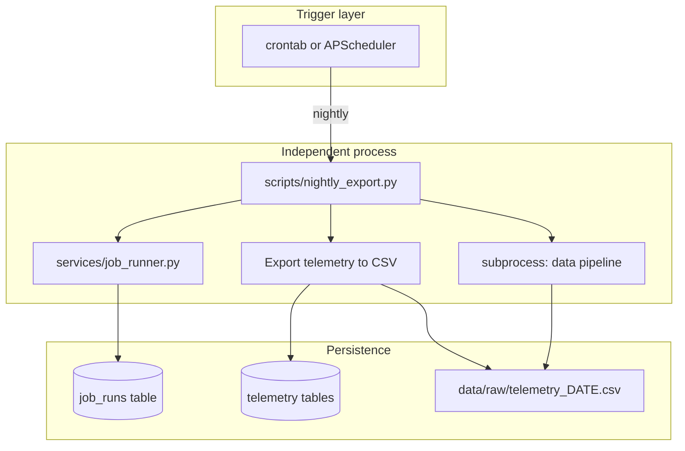

# Background Processes — Reference Solution

This reference solution defines the expected quality bar for the nightly telemetry export job in the student's company monorepo fork. The deliverable is an **independent CLI process** — not a FastAPI background task on the application thread.

---

## Expected file layout

| Area               | Path (indicative)                                                   | Purpose                                                    |
| ------------------ | ------------------------------------------------------------------- | ---------------------------------------------------------- |
| Nightly script     | `scripts/nightly_export.py`                                         | CLI entry point: export, pipeline trigger, job lifecycle   |
| Job runner service | `services/job_runner.py` (or `services/app/services/job_runner.py`) | Create, update, query `job_runs`; distributed lock helpers |
| Migration          | `migrations/` or `db/` SQL                                          | `job_runs` table schema                                    |
| Raw export output  | `data/raw/telemetry_YYYY-MM-DD.csv`                                 | Previous-day telemetry CSV (idempotent)                    |
| Cron / scheduler   | `crontab`, `docker-compose`, or framework scheduler config          | Nightly trigger (documented in PR)                         |

---

## Architecture overview



**Separation rule:** `nightly_export.py` must run as its own process (`python scripts/nightly_export.py`). It must not import FastAPI app startup or block API request handlers.

---

## State machine (`job_runs`)

```
pending → processing → completed
                    ↘ failed
```

| Status       | When set                                              |
| ------------ | ----------------------------------------------------- |
| `pending`    | Record created before work begins                     |
| `processing` | Updated at execution start — acts as distributed lock |
| `completed`  | All steps succeeded for the target date               |
| `failed`     | Any uncaught exception; `error_message` populated     |

**Zombie prevention:** `try/except/finally` must guarantee `processing` never remains after failure. Lock is released on both success and failure paths.

---

## Data model — `job_runs`

Minimum columns:

| Column          | Type        | Notes                                                |
| --------------- | ----------- | ---------------------------------------------------- |
| `id`            | PK          | Auto-increment or UUID                               |
| `job_name`      | string      | e.g. `nightly_export`                                |
| `status`        | enum/string | `pending` \| `processing` \| `completed` \| `failed` |
| `started_at`    | timestamp   | Set when entering `processing`                       |
| `finished_at`   | timestamp   | Set on terminal states                               |
| `error_message` | text/null   | Populated on `failed`                                |
| `created_at`    | timestamp   | Record creation time                                 |

Optional but useful: `target_date` (date column) to support idempotency checks per calendar day.

### Indicative migration (PostgreSQL)

```sql
CREATE TABLE job_runs (
  id SERIAL PRIMARY KEY,
  job_name VARCHAR(64) NOT NULL,
  status VARCHAR(16) NOT NULL CHECK (status IN ('pending', 'processing', 'completed', 'failed')),
  target_date DATE,
  started_at TIMESTAMPTZ,
  finished_at TIMESTAMPTZ,
  error_message TEXT,
  created_at TIMESTAMPTZ NOT NULL DEFAULT NOW()
);

CREATE INDEX idx_job_runs_name_status ON job_runs (job_name, status);
CREATE INDEX idx_job_runs_name_date ON job_runs (job_name, target_date);
```

---

## `services/job_runner.py` — expected API

| Function                                        | Responsibility                                        |
| ----------------------------------------------- | ----------------------------------------------------- |
| `create_run(job_name, target_date)`             | Insert `pending` record                               |
| `mark_processing(run_id)`                       | Transition to `processing`, set `started_at`          |
| `mark_completed(run_id)`                        | Transition to `completed`, set `finished_at`          |
| `mark_failed(run_id, error_message)`            | Transition to `failed`, set `finished_at` + message   |
| `has_processing_lock(job_name)`                 | Returns `True` if any `processing` row exists for job |
| `has_completed_for_date(job_name, target_date)` | Idempotency check                                     |

All DB access lives here — the script orchestrates; the service owns persistence.

---

## `scripts/nightly_export.py` — execution flow

```text
1. Resolve target_date from TARGET_DATE env or default to yesterday (UTC or project TZ — document choice)
2. If has_processing_lock('nightly_export'):
     → log INFO cancellation, exit 0 silently
3. If has_completed_for_date('nightly_export', target_date):
     → log INFO skipped duplicate, exit 0
4. create_run → mark_processing
5. try:
     a. If data/raw/telemetry_{target_date}.csv missing:
          export telemetry rows for target_date to CSV
     b. subprocess.run pipeline command (e.g. python data/pipelines/pipeline.py)
     c. mark_completed
   except Exception as e:
     mark_failed with str(e)
     log ERROR
     re-raise or sys.exit(1) per team convention
   finally:
     ensure no zombie processing state remains
6. log INFO completion with job name, timestamp, status
```

### `TARGET_DATE` override

```bash
TARGET_DATE=2025-01-15 python scripts/nightly_export.py
```

Allows testing arbitrary dates without code changes.

### Indicative log lines

```text
2025-01-16T02:00:01Z INFO nightly_export status=started target_date=2025-01-15
2025-01-16T02:00:45Z INFO nightly_export status=completed target_date=2025-01-15
2025-01-16T02:00:01Z INFO nightly_export status=cancelled reason=processing_lock
2025-01-16T02:00:01Z INFO nightly_export status=skipped reason=duplicate target_date=2025-01-15
2025-01-16T02:00:12Z ERROR nightly_export status=failed error="pipeline exit code 1"
```

---

## Trigger options (student chooses one — document in PR)

| Method                             | Example                                                 | When to prefer                                                                                                            |
| ---------------------------------- | ------------------------------------------------------- | ------------------------------------------------------------------------------------------------------------------------- |
| OS crontab                         | `0 2 * * * cd /app && python scripts/nightly_export.py` | Production servers, Docker sidecar, clear separation from API                                                             |
| APScheduler in separate worker     | Dedicated worker process                                | Already running worker infrastructure                                                                                     |
| Framework scheduler inside FastAPI | `@repeat_every` / lifespan hook                         | **Discouraged** if it shares the API process — violates independence criterion unless run in a dedicated worker container |

**Recommended:** system `crontab` or a dedicated scheduler container — keeps the script fully independent from FastAPI's main thread.

Example cron expression for 02:00 daily:

```cron
0 2 * * * cd /path/to/monorepo && /usr/bin/python scripts/nightly_export.py >> /var/log/nightly_export.log 2>&1
```

---

## CSV export contract

- Path: `data/raw/telemetry_YYYY-MM-DD.csv`
- Content: telemetry rows whose timestamp falls on `target_date` (timezone documented in PR)
- **Skip export** if file already exists (idempotent file layer)
- Header row + one row per event (column names align with student's telemetry schema)

### Indicative CSV excerpt

```csv
event_id,timestamp,session_id,user_id,event_type,schema_version,properties
550e8400-e29b-41d4-a716-446655440000,2025-01-15T10:30:00Z,sess_abc,user_42,outbound_order_created,1.0.0,"{""orderId"":""ord_99""}"
```

---

## Validation evidence

A complete submission should demonstrate:

1. `python scripts/nightly_export.py` runs standalone (no FastAPI server required)
2. `job_runs` row shows full state transition for a successful run
3. Two simultaneous instances: second aborts with cancellation log, no parallel `processing` rows
4. Second run same day: skipped duplicate log, no duplicate CSV, no second pipeline execution
5. Forced pipeline failure: row ends `failed`, not `processing`; error in `error_message`
6. `TARGET_DATE=2025-01-15 python scripts/nightly_export.py` works without code edits
7. PR includes cron expression, trigger method justification, sample logs (success + failed/blocked), CSV excerpt screenshot

---

## Common mistakes (incomplete submissions)

- Running export inside FastAPI `@app.on_event("startup")` or request handler
- No distributed lock — parallel runs corrupt pipeline or duplicate loads
- `processing` zombie after exception (missing `except`/`finally`)
- Re-exporting CSV or re-running pipeline when `completed` exists for date
- Hardcoded yesterday date with no `TARGET_DATE` env override
- Pipeline triggered before export completes
- Logs missing timestamp, job name, or status on relevant events

---

## Evaluation checklist

- [ ] Independent CLI process — no FastAPI main-thread execution
- [ ] `job_runs` state machine: `pending → processing → completed | failed`
- [ ] Distributed lock prevents parallel executions (demonstrable)
- [ ] Idempotent: duplicate same-day run skips export + pipeline
- [ ] No zombie `processing` after failure
- [ ] CSV in `data/raw/` with correct date naming and prior-day data
- [ ] `services/job_runner` module with create/update/query functions
- [ ] `TARGET_DATE` env override for testing
- [ ] INFO/ERROR logs with timestamp, job name, status
- [ ] Cron/scheduler configured and documented in PR with `cronjob` label

---

## Reviewer notes

- Telemetry table/column names vary per company CONTEXT — grade against the student's existing schema, not this document verbatim.
- Pipeline subprocess command should match the student's Prefect/CLI entry from Milestone 6 — do not penalize different invoke strings if documented.
- `crontab` vs framework scheduler is a design choice; grade the justification and independence criterion, not the specific tool if requirements are met.
