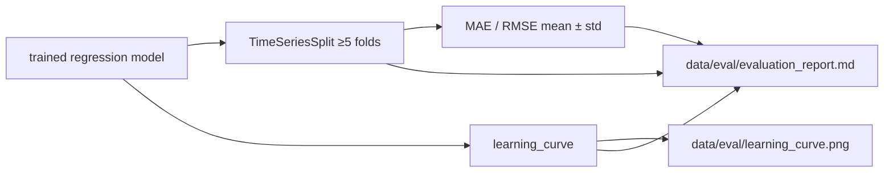

# Evaluating a Regression Model — Reference Solution

This reference solution describes the expected architecture, deliverables, and validation evidence for a complete submission. Students continue on their company **[monorepo](https://github.com/4GeeksAcademy/ai-engineering-company-project-monorepo)** fork, building on the regression model and 8-year/2-year temporal split from the previous sales forecasting project.

---

## Expected file layout

| File                                  | Purpose                                             |
| ------------------------------------- | --------------------------------------------------- |
| `pipelines/evaluate_sales_model.py`   | Temporal CV, learning curve, MAE/RMSE calculation   |
| `data/eval/learning_curve.png`        | Training vs validation error as training size grows |
| `data/eval/evaluation_report.md`      | Diagnosis, metric comparison, corrective action     |
| `tests/pipelines/test_temporal_cv.py` | Asserts chronological order preserved in each fold  |

---

## Architecture overview



**Critical rule:** Use **temporal** cross-validation (`TimeSeriesSplit`), not `KFold` with shuffle. Shuffling time-series data leaks future information into training folds and invalidates the stability assessment.

---

## Temporal cross-validation

Run at least 5 folds over the **training set only** (the 8-year portion — do not include the held-out 2 test years):

```python
from sklearn.model_selection import TimeSeriesSplit

tscv = TimeSeriesSplit(n_splits=5)
scores = []
for train_idx, val_idx in tscv.split(X_train):
    assert max(train_idx) < min(val_idx)  # chronological: train before val
    model.fit(X_train[train_idx], y_train[train_idx])
    scores.append(metric(y_train[val_idx], model.predict(X_train[val_idx])))

mean_score = np.mean(scores)
std_score = np.std(scores)
# Report as: f"{mean_score:.4f} ± {std_score:.4f}"
```

Report the primary metric as **mean ± standard deviation** across folds — a single aggregate number hides instability.

---

## Learning curve

Use `sklearn.model_selection.learning_curve` or equivalent to plot training and validation error as training set size increases. Save to `data/eval/learning_curve.png`.

| Pattern                                      | Diagnosis    | Typical corrective action                                                         |
| -------------------------------------------- | ------------ | --------------------------------------------------------------------------------- |
| Both curves converge at **high** error       | Underfitting | Increase model complexity or improve features — not "add more data" first         |
| **Wide gap**: train low, val high            | Overfitting  | Regularization, reduce complexity, or more data — not "increase complexity" first |
| Both curves converge at **low, close** error | Well fitted  | Document stability; no major change needed                                        |

The report must **explicitly interpret** which pattern the curve shows — not just attach the image.

---

## Metric selection (MAE vs RMSE)

Calculate both on training and validation. Choose one as primary based on business cost from `CONTEXT-company.md`:

| Metric   | Penalizes                            | Better when...                                                                 |
| -------- | ------------------------------------ | ------------------------------------------------------------------------------ |
| **MAE**  | All errors equally (L1)              | Large outliers are rare; underestimating and overestimating are equally costly |
| **RMSE** | Large errors disproportionately (L2) | Big misses are far more expensive (e.g. stockouts from underestimating sales)  |

Example justification:

> Our CONTEXT indicates underestimating peak-season sales causes stockouts — large errors are disproportionately costly. RMSE is the primary metric because it penalizes those large misses more than MAE.

---

## Technical report (`data/eval/evaluation_report.md`)

A complete report answers the three ticket questions:

1. **Fit diagnosis** — well fitted / underfitting / overfitting, backed by learning curve pattern.
2. **Stability** — temporal CV results as mean ± std; comment on variance across folds.
3. **Corrective action** — specific and consistent with diagnosis (e.g. "Reduce `max_depth` from 12 to 6 and add `min_samples_leaf=10` to address overfitting visible in the learning curve gap").

Generic answers like "add more data" or "tune hyperparameters" without linking to evidence are **not** acceptable.

---

## Required unit test (`tests/pipelines/test_temporal_cv.py`)

```python
def test_temporal_cv_preserves_chronological_order():
    tscv = TimeSeriesSplit(n_splits=5)
    for train_idx, val_idx in tscv.split(X_train):
        assert max(train_idx) < min(val_idx)
        # No later-fold index appears before an earlier-fold index
        assert list(train_idx) == sorted(train_idx)
        assert list(val_idx) == sorted(val_idx)
```

---

## Validation checklist

- [ ] `TimeSeriesSplit` with ≥ 5 folds on training set only — no shuffle
- [ ] Primary metric reported as mean ± standard deviation across folds
- [ ] Learning curve saved to `data/eval/learning_curve.png` with explicit interpretation
- [ ] MAE and RMSE calculated for train and validation
- [ ] Primary metric justified with business context from `CONTEXT.md`
- [ ] Report classifies model as well fitted / underfitting / overfitting with evidence
- [ ] Corrective action is specific and tied to the diagnosis
- [ ] Chronological-order unit test passes

---

## Key implementation decisions

- **Temporal CV, not random:** `KFold(shuffle=True)` on time-series data leaks future into past folds. Always use `TimeSeriesSplit`.
- **Train set only for CV:** The 2 held-out test years stay untouched — CV assesses stability within training data.
- **Evidence over opinion:** Diagnosis must cite learning curve pattern and CV variance, not gut feeling.
- **Business-grounded metrics:** MAE vs RMSE choice must reference which error direction costs more for the company.
- **Specific corrective actions:** Tie recommendations to the diagnosed root cause (bias vs variance), not generic ML advice.
