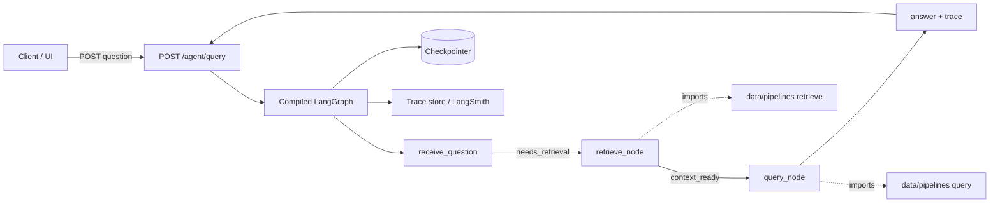

# Support Agent with LangGraph — Part 1 — Reference Solution

Reference quality bar for the student's company monorepo fork. Paths and collection names below are **indicative** — students must align with their assigned `CONTEXT-company.md` and existing Milestone 7 pipeline layout.

---

## Architecture overview



**Design invariants:**

1. Milestone 7 functions (`retrieve`, `query`, `embed`, `setup`) stay in `data/pipelines/` — graph nodes import them, never duplicate logic.
2. Graph state is minimal: question, retrieved context, partial/final answer, trace metadata — not full chat history.
3. Graph is compiled once at startup; structural errors fail at import/compile time.
4. Endpoint is a thin adapter: validate input, invoke graph, map errors — no RAG business logic in the route.
5. Every run produces a queryable trace (LangSmith run, structured JSON log, or checkpoint history).

---

## Expected file layout

| Area          | Path (indicative)                     | Purpose                                           |
| ------------- | ------------------------------------- | ------------------------------------------------- |
| Graph state   | `services/agent/state.py`             | TypedDict / Pydantic state schema                 |
| Nodes         | `services/agent/nodes.py`             | `receive_question`, `retrieve_node`, `query_node` |
| Graph builder | `services/agent/graph.py`             | Nodes, conditional edges, compile + checkpointer  |
| Tracing       | `services/agent/tracing.py`           | Trace collector or LangSmith callback wiring      |
| API router    | `services/app/routers/agent.py`       | `POST /agent/query`                               |
| Evals         | `tests/pipelines/test_agent_evals.py` | ≥3 trace/answer assertions                        |

---

## Graph state (minimal)

```python
from typing import TypedDict, Annotated, Sequence
import operator

class AgentState(TypedDict):
    question: str
    retrieved_context: list[dict] | None
    answer: str | None
    trace_steps: Annotated[Sequence[dict], operator.add]
    error: str | None
```

Justification: nodes only need the current question, retrieval output, and accumulated trace — not prior turns.

---

## Nodes and conditional edges

| Node               | Responsibility                                 | Output condition                                                 |
| ------------------ | ---------------------------------------------- | ---------------------------------------------------------------- |
| `receive_question` | Normalize/validate input, seed trace           | Always route to retrieval when question non-empty                |
| `retrieve_node`    | Call `data.pipelines.retrieve(question)`       | Route to `query_node` when context returned (even if empty list) |
| `query_node`       | Call `data.pipelines.query(question, context)` | End graph with final answer                                      |

Routing function example (not a hardcoded linear chain only):

```python
def after_receive(state: AgentState) -> str:
    if not state.get("question", "").strip():
        return "end"
    return "retrieve"

def after_retrieve(state: AgentState) -> str:
    if state.get("error"):
        return "end"
    return "query"
```

---

## Compilation and checkpointing

```python
from langgraph.graph import StateGraph, END
from langgraph.checkpoint.memory import MemorySaver

def build_agent_graph():
    builder = StateGraph(AgentState)
    builder.add_node("receive_question", receive_question)
    builder.add_node("retrieve", retrieve_node)
    builder.add_node("query", query_node)
    builder.set_entry_point("receive_question")
    builder.add_conditional_edges("receive_question", after_receive, {"retrieve": "retrieve", "end": END})
    builder.add_conditional_edges("retrieve", after_retrieve, {"query": "query", "end": END})
    builder.add_edge("query", END)
    checkpointer = MemorySaver()
    return builder.compile(checkpointer=checkpointer)
```

Compile at module load or FastAPI lifespan — never per request without caching.

---

## Tracing

Each node appends to `trace_steps`:

```python
{"node": "retrieve", "order": 2, "output_summary": "3 chunks above threshold"}
```

Alternative: LangSmith via `LANGCHAIN_TRACING_V2=true` and run metadata. PR must include screenshot or JSON export of one full run.

---

## Endpoint contract

**Request**

```json
{ "question": "What is the return policy for enterprise clients?" }
```

**Success (200)**

```json
{
  "answer": "Enterprise clients may return within 30 days...",
  "trace_id": "run-abc123"
}
```

**Graph/node failure (4xx/5xx — no raw stack trace)**

```json
{ "detail": "Agent failed during retrieval. Check trace run-abc123." }
```

---

## Evals (`tests/pipelines/`)

Run with a single command, e.g. `uv run pytest tests/pipelines/ -q`.

| Eval            | Input                        | Criterion                                                    |
| --------------- | ---------------------------- | ------------------------------------------------------------ |
| Node order      | Fixed FAQ question           | Trace shows `retrieve` before `query`                        |
| Grounded answer | Policy question from CONTEXT | Answer mentions expected entity; not empty                   |
| Error path      | Empty question               | Trace ends without `query`; clear error in state or response |

Evals assert against saved trace fixtures or checkpoint snapshots — not live LLM calls on every CI run when mocked.

---

## Validation checklist

- [ ] State schema is minimal; no unjustified full history.
- [ ] Three single-responsibility nodes; edges use conditional routing.
- [ ] Graph compiled before serving; broken graph fails at startup.
- [ ] Checkpointer attached; at least one transition inspectable.
- [ ] Queryable trace per run.
- [ ] ≥3 evals in `tests/pipelines/`.
- [ ] `POST /agent/query` delegates to graph only.
- [ ] Milestone 7 pipeline functions reused from `data/pipelines/`.
