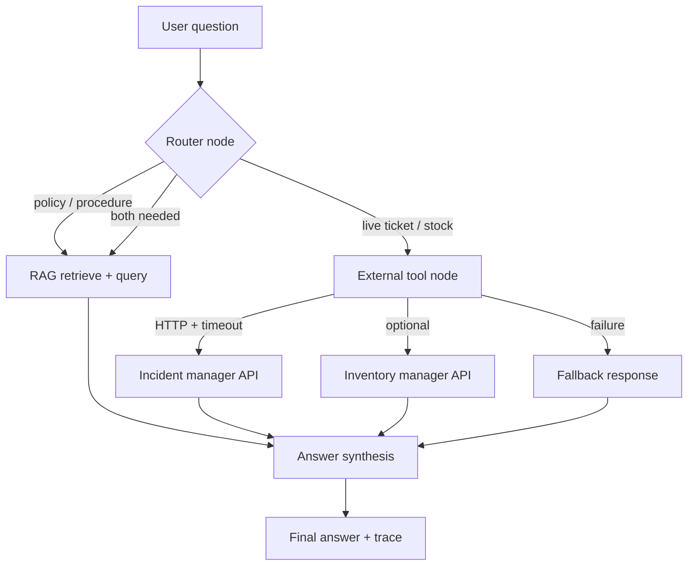

# Support Agent with LangGraph — Part 2 of 2: Tools Outside the RAG — Reference Solution

Reference quality bar for the student's company monorepo fork. Values below are **indicative** — students must align field names, routes, and service URLs with their assigned `CONTEXT-company.md` and the incident/inventory services they built in earlier projects.

---

## Architecture overview



**Design invariants:**

1. Tools call **live HTTP endpoints** on services the student already built — never mocked ticket/inventory data inside the agent service.
2. Each tool has **one responsibility** (tickets vs inventory are separate tools).
3. Timeouts and fallback paths are **explicit graph branches**, not uncaught exceptions.
4. Traces must show **which source ran** (RAG, tool, or both) and **in what order**.

---

## Required tool: incident ticket lookup

### Typed contract (indicative)

```python
class TicketLookupInput(BaseModel):
    ticket_id: int | None = None
    status: str | None = None  # optional filter for list endpoint

class TicketLookupOutput(BaseModel):
    found: bool
    ticket_id: int | None = None
    status: str | None = None
    category: str | None = None
    source: str | None = None
    created_at: str | None = None
    updated_at: str | None = None
    error: str | None = None  # set on timeout / HTTP failure
```

### HTTP integration

- `GET /api/incidents/{id}` when `ticket_id` is present.
- `GET /api/incidents` with query params when filtering.
- Configure base URL from environment (same pattern as other monorepo services).
- Apply an explicit timeout (e.g. 3–5 seconds) on every request.

### Fallback behavior

When the service times out, returns non-2xx, or the ticket is missing:

- Set `found=False` and a structured `error` in tool output.
- Route to a synthesis/fallback node that produces an honest answer (e.g. "I couldn't confirm that ticket's status right now").
- **Never** invent status, category, or dates.

---

## Stretch tool: inventory lookup (optional)

Same pattern as tickets:

- Input: product identifier or search filter aligned with `GET /inventory/products`.
- Output: stock fields exposed by the student's inventory API.
- Separate tool function and graph node — do not combine with ticket lookup.

---

## Graph changes (extends Part 1)

Expected additions on top of the Part 1 compiled graph:

| Node                  | Responsibility                                    |
| --------------------- | ------------------------------------------------- |
| `route_intent`        | Classify question → RAG, tool(s), or both         |
| `lookup_ticket`       | Run ticket tool against incident manager          |
| `lookup_inventory`    | (Optional) Run inventory tool                     |
| `handle_tool_failure` | Map tool errors to honest user-facing text        |
| `synthesize_answer`   | Merge RAG context + tool results into final reply |

Conditional edges must depend on **structured router output** or tool results — not a fixed sequence for every question.

Extend graph state minimally, for example:

- `question`
- `route` (`rag` \| `tool` \| `both`)
- `retrieved_context` (from RAG path)
- `tool_results` (list of typed tool outputs)
- `final_answer`

---

## Tracing

Each run trace (LangSmith or structured log) should include:

1. Router decision and rationale (if logged).
2. Node execution order.
3. Per-tool HTTP outcome (`success`, `timeout`, `not_found`, `http_error`).
4. Whether RAG nodes executed.

PR evidence: attach one trace with ticket tool usage and one with RAG-only routing.

---

## Evals (`tests/pipelines/`)

Minimum **2 new evals** (plus optional third for fallback):

| Eval                | Input (indicative)                                 | Assertion on trace / output                                                                        |
| ------------------- | -------------------------------------------------- | -------------------------------------------------------------------------------------------------- |
| Tool routing        | "What is the status of ticket 482?"                | Ticket tool node ran; RAG retrieve did **not** run (or ran only after tool if `both` is justified) |
| RAG routing         | "What is the refund policy for delayed shipments?" | RAG path ran; ticket/inventory tools did **not** run                                               |
| Fallback (optional) | Same ticket question with incident service down    | Fallback node or honest failure message; no fabricated ticket status                               |

Evals should inspect **stored traces** or deterministic graph outputs — not require live HTTP on every CI run if the student stubs the HTTP client in test fixtures while still proving routing logic.

---

## Submission checklist

- [ ] Typed ticket tool contract implemented.
- [ ] Real incident manager HTTP calls with timeout.
- [ ] Verifiable fallback when tool fails or resource missing.
- [ ] Automatic routing without user specifying source.
- [ ] Separate tools for tickets and inventory (if inventory built).
- [ ] Trace distinguishes sources and order.
- [ ] ≥ 2 new routing evals in `tests/pipelines/`.
- [ ] PR labeled `part-2-external-tools` / `parte-2-tools-externas` with traces and eval output.
