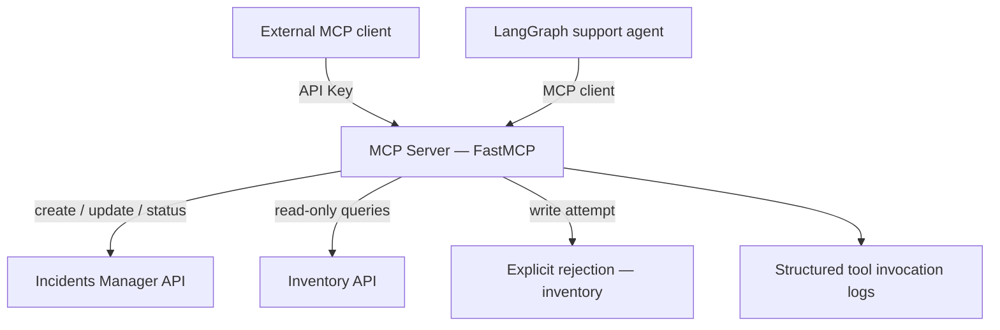

# MCP Server: Connecting Your Agent to the Company's Tools — Reference Solution

Reference quality bar for the student's company monorepo fork. Values below are **indicative** — students must align field names, routes, and service URLs with their assigned `CONTEXT-company.md` and the incident/inventory services they built in earlier projects.

---

## Architecture overview



**Design invariants:**

1. MCP tools call **live HTTP endpoints** on services the student already built — never mocked operational data inside the MCP service.
2. Inventory exposure is **read-only by design** — write attempts return a distinct authorization error, not a missing tool.
3. API Key auth gates **discovery and invocation** — unauthenticated clients cannot list tools.
4. The support agent has **one path** to incidents: through the MCP client node, not a parallel direct HTTP tool.

---

## Recommended service layout

| Path (indicative)                        | Responsibility                                                      |
| ---------------------------------------- | ------------------------------------------------------------------- |
| `services/mcp-server/`                   | FastMCP app, tool definitions, auth middleware, invocation logging  |
| `services/mcp-server/tools/incidents.py` | Ticket create, update, status lookup                                |
| `services/mcp-server/tools/inventory.py` | Read-only inventory queries + explicit write rejection              |
| `services/mcp-server/auth.py`            | API Key validation, client identity for logs                        |
| `services/agent/` (existing)             | LangGraph graph with MCP client node replacing direct incident tool |

---

## Transport decision (document in PR)

| Transport           | When to choose                                               | Auth implication                                                 |
| ------------------- | ------------------------------------------------------------ | ---------------------------------------------------------------- |
| **stdio**           | Local dev, single process, agent spawns server as subprocess | Key via env var / header in wrapper                              |
| **Streamable HTTP** | Remote clients, multiple teams, external partners            | API Key on every HTTP request; server runs as standalone service |

Students must justify their choice in the PR description.

---

## Tool: incident ticket management

### Discovery contract (indicative)

- **Name:** `manage_incident_ticket`
- **Description:** Create, update, or query status of an incident ticket in the company Incidents Manager. Requires valid API Key.
- **Input schema:** `ticket_id`, `action` (`create` \| `update` \| `get_status`), payload fields aligned with `CONTEXT-company.md`.
- **Output schema:** Structured ticket fields or explicit error with code.

### HTTP integration

- `POST /api/incidents` for create.
- `PATCH /api/incidents/{id}` for update.
- `GET /api/incidents/{id}` for status.
- Base URL from environment; explicit timeouts on every call.

---

## Tool: inventory (read-only)

### Discovery contract (indicative)

- **Name:** `query_inventory`
- **Description:** Read-only lookup of inventory products/stock. Write operations are not supported and will be rejected.
- **Input schema:** Product identifier or filter params aligned with inventory API.
- **Output schema:** Stock fields from the student's inventory service.

### Write rejection (required)

If a client passes `action: "update"` or any write-oriented field:

```json
{
  "error_code": "INVENTORY_WRITE_FORBIDDEN",
  "message": "Inventory tool is read-only. Write operations are not permitted on this MCP server.",
  "tool": "query_inventory"
}
```

This must be a **distinct** error from auth failures and validation errors.

---

## Authentication and error codes

| Scenario                | Code (indicative)           | HTTP / MCP behavior               |
| ----------------------- | --------------------------- | --------------------------------- |
| Missing API Key         | `AUTH_MISSING_KEY`          | Reject before tool list or invoke |
| Invalid API Key         | `AUTH_INVALID_KEY`          | Reject with 401-equivalent        |
| Inventory write attempt | `INVENTORY_WRITE_FORBIDDEN` | Reject with 403-equivalent        |
| Invalid tool input      | `VALIDATION_ERROR`          | Reject with field-level detail    |

Each code must have a documented message — not a generic `"error"`.

---

## Invocation logging (required)

Every tool call should emit a structured log entry:

```json
{
  "timestamp": "2026-07-07T12:00:00Z",
  "client_id": "agent-support-prod",
  "tool": "manage_incident_ticket",
  "input_summary": { "action": "get_status", "ticket_id": 482 },
  "result": "success",
  "duration_ms": 145
}
```

---

## Agent migration (extends Part 2 LangGraph project)

Expected graph change:

| Before                                                     | After                                                    |
| ---------------------------------------------------------- | -------------------------------------------------------- |
| `lookup_ticket` node calls Incidents Manager HTTP directly | `mcp_incidents` node calls MCP Server via MCP client SDK |
| Direct incident tool in tool registry                      | Removed or deprecated — single path only                 |

Conditional routing between RAG and tools must remain unchanged in behavior.

---

## MCP client validation

Provide a small client script (TypeScript or Python) that:

1. Connects with a valid API Key.
2. Lists tools via MCP discovery and asserts schemas are present.
3. Runs one full flow per tool (ticket create/update/status, inventory query).
4. Demonstrates inventory write rejection with the expected error code.

---

## Submission checklist

- [ ] FastMCP server under `services/` with API Key auth on discovery + invoke.
- [ ] Incident ticket tool: create, update, status against real Incidents Manager.
- [ ] Inventory tool: read queries work; writes return `INVENTORY_WRITE_FORBIDDEN`.
- [ ] Tool descriptions and schemas self-explanatory via MCP discovery.
- [ ] Distinct error codes for auth, authorization, and validation.
- [ ] Structured log per tool invocation (client, tool, result).
- [ ] Agent graph migrated: MCP client replaces direct incident tool.
- [ ] PR documents transport choice and includes client validation evidence.
