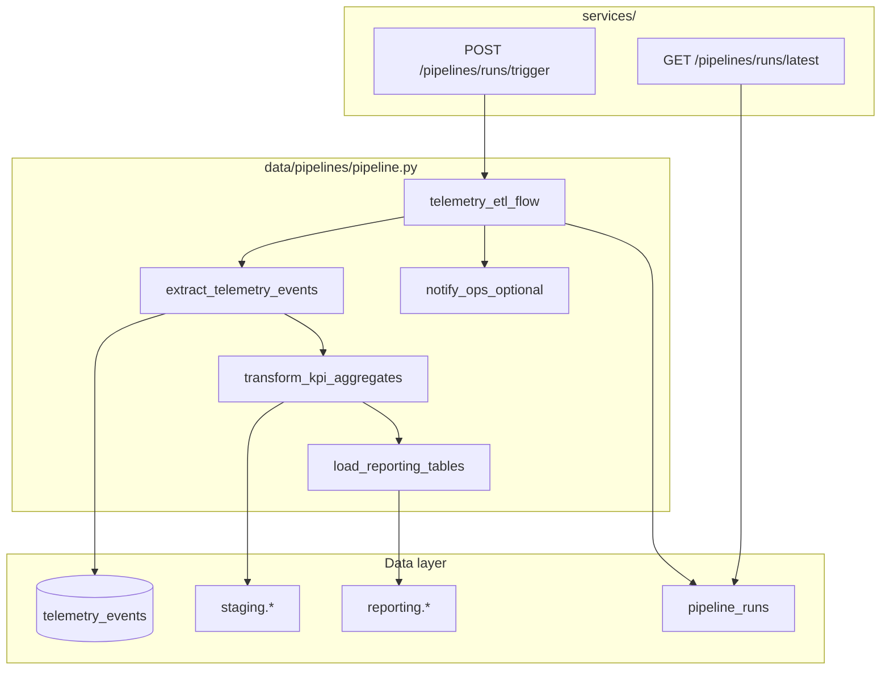

# Milestone 6 — Implementing a Resilient Data Pipeline (2/3) — Reference Solution

This reference solution defines the expected quality bar for deliverables in the student's company monorepo fork:

- `data/pipelines/pipeline.py` — Prefect flows and tasks
- `services/` — API endpoints that query or trigger the pipeline
- Prefect deployment with schedule and Docker work pool
- Execution metadata persisted per run

The deliverable is **runnable orchestration code** that implements the student's approved `data/pipelines/PIPELINE_DESIGN.md`. Generic pipelines that ignore CONTEXT entity names should be treated as incomplete.

## Alignment with company context

All flow names, task names, table names, event names, and KPI grains must come from the student's assigned **CONTEXT-company.md** and their design doc. The examples below use inventory telemetry naming — students must substitute their company-specific names.

---

## Solution architecture



**Component boundaries:**

| Layer                               | Responsibility                                                                         |
| ----------------------------------- | -------------------------------------------------------------------------------------- |
| `data/pipelines/pipeline.py`        | Prefect `@flow` / `@task` definitions, resilience config, idempotent load logic        |
| `services/`                         | HTTP surface — imports flows/functions from `data/pipelines/`; no duplicated ETL logic |
| `pipeline_runs` (or structured log) | Per-run metadata: start, end, rows processed, status, errors                           |

---

## Expected file structure

```
data/
  pipelines/
    pipeline.py          # Main entry point — at least one @flow, 3+ @task
    PIPELINE_DESIGN.md   # Student's approved design (from Part 1)
  raw/                   # Input snapshots / intermediate files
  process/               # Reusable transform helpers
  eval/                  # Pipeline validation outputs
services/
  routes/pipelines.py    # (example) status + trigger endpoints
```

---

## Prefect resilience patterns (reference)

### Retries on external I/O

```python
@task(retries=3, retry_delay_seconds=30)
def extract_telemetry_events(watermark_from: datetime) -> list[dict]:
    # 3 retries: absorbs transient DB/API blips without paging on-call.
    ...
```

### Optional task with partial failure tolerance

```python
@task(allow_failure=True)
def notify_ops_optional(summary: dict) -> None:
  ...

@flow
def telemetry_etl_flow():
    ...
    notify_ops_optional(summary)  # flow continues if Slack/webhook fails
```

### Explicit failure handling

```python
@task(raise_on_failure=False)
def export_csv_optional(rows: list[dict]) -> str | None:
    ...

@flow
def telemetry_etl_flow():
    path = export_csv_optional(rows)
    if path is None:
        logger.warning("CSV export skipped — non-critical")
```

### Caching expensive transform

```python
def transform_cache_key(ctx, parameters):
    return f"{parameters['watermark_from']}-{parameters['watermark_to']}"

@task(
    cache_key_fn=transform_cache_key,
    cache_expiration=timedelta(hours=1),
)
def transform_kpi_aggregates(rows: list[dict], ...) -> list[dict]:
    # Cache key = processed window; valid 1h per CTO ticket (skip repeat within hour).
    ...
```

---

## Idempotency and execution log

**Load phase** must use the strategy from `PIPELINE_DESIGN.md` — typical patterns:

- Upsert on business grain `(report_date, warehouse_id, product_id)`
- `ON CONFLICT DO UPDATE` for aggregate tables
- Watermark advanced only after successful load commit

**Minimum metadata per run** (≥5 fields):

| Field               | Example                                               |
| ------------------- | ----------------------------------------------------- |
| `started_at`        | `2026-06-24T02:00:01Z`                                |
| `finished_at`       | `2026-06-24T02:03:12Z`                                |
| `records_processed` | `1842`                                                |
| `status`            | `success` / `failed` / `partial`                      |
| `error_summary`     | `null` or `"load_reporting_tables: connection reset"` |

Persist in `pipeline_runs` table or structured JSON log under `data/eval/`.

---

## Deployment and schedule

```python
# Example: nightly at 02:00 UTC — aligns with design doc refresh cadence
from prefect.deployments import Deployment
from prefect.server.schemas.schedules import CronSchedule

deployment = Deployment.build_from_flow(
    flow=telemetry_etl_flow,
    name="nightly-telemetry-etl",
    schedule=CronSchedule(cron="0 2 * * *", timezone="UTC"),
    work_pool_name="docker-pool",
)
```

Verify CLI trigger:

```bash
prefect deployment run telemetry-etl-flow/nightly-telemetry-etl
```

---

## Expected API surface

Endpoints follow existing monorepo auth and response conventions.

### `GET /pipelines/runs/latest` — last run metadata

```json
{
  "run_id": "a1b2c3d4-e5f6-7890-abcd-ef1234567890",
  "status": "success",
  "started_at": "2026-06-24T02:00:01Z",
  "finished_at": "2026-06-24T02:03:12Z",
  "records_processed": 1842,
  "error_summary": null
}
```

### `POST /pipelines/runs/trigger` — manual execution

```json
{
  "message": "Pipeline run submitted",
  "flow_run_id": "prefect-flow-run-uuid"
}
```

Implementation must call the flow from `data/pipelines/pipeline.py` — not re-implement extract/transform/load in `services/`.

---

## Common mistakes (incomplete submissions)

- Single script without `@flow` / `@task` decorators
- Retries missing on DB/API tasks, or no comment justifying retry count
- Optional step fails and stops entire flow (missing `allow_failure=True`)
- No cache on any transform task
- Load appends rows on re-run → duplicates in reporting tables
- Fewer than five metadata fields logged per execution
- Deployment missing schedule or Docker work pool
- Endpoints duplicate pipeline logic instead of importing from `data/pipelines/`
- Generic table/event names that do not match CONTEXT or design doc

---

## Evaluation checklist

- [ ] `data/pipelines/pipeline.py` exists with ≥1 flow and ≥3 tasks
- [ ] ≥1 task has `retries > 0` with justification comment
- [ ] ≥1 optional task uses `allow_failure=True`; flow continues on its failure
- [ ] ≥1 transform task has `cache_key_fn` + `cache_expiration` with comment
- [ ] Load is idempotent — second run on same data produces no duplicates
- [ ] Each run logs ≥5 metadata fields (start, end, records, status, errors)
- [ ] Prefect deployment with schedule + Docker infrastructure
- [ ] CLI `prefect deployment run` succeeds
- [ ] `GET` endpoint returns last run metadata
- [ ] `POST` endpoint triggers manual run via import from `data/pipelines/`
- [ ] Implementation matches `PIPELINE_DESIGN.md` stages and resilience choices
- [ ] Commit message `feat: implement resilient prefect pipeline`

---

## Auxiliary reference

See `PIPELINE_DESIGN.example.md` in this folder for a condensed design excerpt illustrating the spec students implement. Students must use their own `data/pipelines/PIPELINE_DESIGN.md` from Part 1 — do not copy verbatim.
