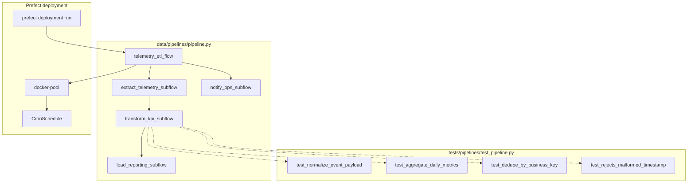

# Milestone 6 — Company's Data Pipeline Enhancement: Subflows and Tests (3/3) — Reference Solution

This reference solution defines the expected quality bar for deliverables in the student's company monorepo fork:

- `data/pipelines/pipeline.py` — main flow orchestrating extract, transform, and load subflows
- `tests/pipelines/test_pipeline.py` — isolated unit tests for transformation tasks
- Prefect deployment with Docker work pool and schedule
- Schedule pause/resume documented in `PIPELINE_DESIGN.md` or inline comments

The deliverable is **production-ready orchestration** built on the Part 2 pipeline. Generic subflow or test names that ignore CONTEXT entity vocabulary should be treated as incomplete.

## Alignment with company context

All subflow names, task names, and test names must come from the student's assigned **CONTEXT-company.md** and their `PIPELINE_DESIGN.md`. The examples below use inventory telemetry naming — students must substitute their company-specific names.

---

## Solution architecture



**Component boundaries:**

| Layer                        | Responsibility                                                              |
| ---------------------------- | --------------------------------------------------------------------------- |
| `data/pipelines/pipeline.py` | Main `@flow` coordinates subflows; no inline ETL logic in main flow body    |
| Subflows (`@flow`)           | One per pipeline phase — explicit inputs/outputs, independently runnable    |
| `data/process/`              | Pure transform helpers imported by tasks (testable without Prefect runtime) |
| `tests/pipelines/`           | Unit tests call task functions or helpers directly with in-memory fixtures  |
| Prefect deployment           | Docker work pool, named schedule, env vars for DB/API credentials           |

---

## Expected file structure

```
data/
  pipelines/
    pipeline.py              # Main flow + ≥3 subflows
    PIPELINE_DESIGN.md       # Schedule pause/resume notes added in Part 3
  process/                   # Transform helpers (imported by tasks)
tests/
  pipelines/
    test_pipeline.py         # ≥3 transform tests + ≥1 defensive test
```

---

## Subflow refactoring patterns (reference)

### Main flow delegates to subflows

```python
@flow(name="extract-telemetry-events")
def extract_telemetry_subflow(watermark_from: datetime) -> list[dict]:
    return extract_telemetry_events(watermark_from)

@flow(name="transform-kpi-aggregates")
def transform_kpi_subflow(rows: list[dict], watermark_to: datetime) -> list[dict]:
    return transform_kpi_aggregates(rows, watermark_to=watermark_to)

@flow(name="load-reporting-tables")
def load_reporting_subflow(aggregates: list[dict], run_id: str) -> int:
    return load_reporting_tables(aggregates, run_id=run_id)

@flow
def telemetry_etl_flow():
    watermark_from = resolve_watermark()
    rows = extract_telemetry_subflow(watermark_from)
    aggregates = transform_kpi_subflow(rows, watermark_to=datetime.now(UTC))
    records = load_reporting_subflow(aggregates, run_id=str(uuid4()))
    notify_ops_subflow(records, allow_failure=True)
    return records
```

### Optional subflow with `allow_failure=True`

```python
@flow
def notify_ops_subflow(summary: int) -> None:
    notify_ops_optional(summary)

# In main flow:
notify_ops_subflow(summary, return_state=True)  # or invoke as subflow with allow_failure
```

Subflows must pass data through return values — not module-level globals.

---

## Unit test patterns (reference)

Tests target **transformation tasks or pure helpers** in `data/process/`, not live DB connections.

```python
import pytest
from data.process.transforms import normalize_event_payload, aggregate_daily_metrics

def test_normalize_event_payload_maps_inventory_fields():
    raw = {"event_type": "stock_threshold_low", "warehouse_id": "wh-1", "qty": 3}
    result = normalize_event_payload(raw)
    assert result["warehouse_id"] == "wh-1"
    assert result["event_type"] == "stock_threshold_low"

def test_aggregate_daily_metrics_groups_by_report_date_and_product():
    rows = [
        {"report_date": "2026-06-01", "product_id": "p-1", "units": 2},
        {"report_date": "2026-06-01", "product_id": "p-1", "units": 3},
    ]
    result = aggregate_daily_metrics(rows)
    assert len(result) == 1
    assert result[0]["units"] == 5

def test_rejects_malformed_timestamp_raises_or_returns_none():
    raw = {"event_type": "login_failed", "occurred_at": None}
    with pytest.raises(ValueError):
        normalize_event_payload(raw)
```

Run:

```bash
python -m pytest tests/pipelines/test_pipeline.py -v
```

---

## Deployment and schedule

```python
from prefect.deployments import Deployment
from prefect.server.schemas.schedules import CronSchedule

deployment = Deployment.build_from_flow(
    flow=telemetry_etl_flow,
    name="nightly-telemetry-etl",
    schedule=CronSchedule(cron="0 2 * * *", timezone="UTC"),
    work_pool_name="docker-pool",
    # env: DATABASE_URL, PREFECT_API_KEY, etc.
)
```

Verify CLI trigger:

```bash
prefect deployment run telemetry-etl-flow/nightly-telemetry-etl
```

Document schedule control in `PIPELINE_DESIGN.md`:

```bash
prefect deployment pause-schedule telemetry-etl-flow/nightly-telemetry-etl
prefect deployment resume-schedule telemetry-etl-flow/nightly-telemetry-etl
```

---

## Common mistakes (incomplete submissions)

- Main flow still contains all extract/transform/load logic inline — no subflows
- Subflows share state through global variables instead of explicit parameters
- Tests hit production DB or external APIs instead of in-memory fixtures
- Fewer than three transformation tests, or no defensive test for malformed input
- Deployment missing Docker work pool or schedule
- `prefect deployment run` fails due to missing env vars in work pool template
- Generic names (`extract_data`, `test_transform`) instead of CONTEXT vocabulary
- Optional notification subflow failure aborts the entire main flow

---

## Evaluation checklist

- [ ] `data/pipelines/pipeline.py` main flow invokes ≥3 subflows (`@flow`)
- [ ] Each subflow has explicit inputs/outputs and can run independently
- [ ] `tests/pipelines/test_pipeline.py` exists with ≥3 transform unit tests
- [ ] ≥1 test verifies defensive behaviour against invalid/malformed input
- [ ] `python -m pytest tests/pipelines/test_pipeline.py` passes
- [ ] Prefect deployment uses Docker work pool with defined schedule
- [ ] `prefect deployment run <flow>/<deployment>` succeeds
- [ ] Schedule pause/resume documented
- [ ] Subflow, task, and test names match CONTEXT-company.md vocabulary
- [ ] Commit message `feat: refactor pipeline into subflows and add unit tests`
