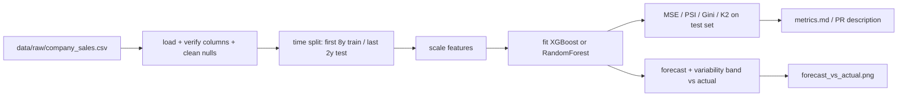

# Sales Forecasting with a Regression Model — Reference Solution

This reference solution describes the expected architecture, deliverables, and validation evidence for a complete submission. Students train and evaluate a regression model on their company's historical sales CSV already included in `data/raw/<company>_sales.csv` inside their fork of the company **[monorepo](https://github.com/4GeeksAcademy/ai-engineering-company-project-monorepo)** — column names and format must match their `CONTEXT-company.md`. No dataset generation or simulation is required.

---

## Expected file layout

| File                                    | Purpose                                                                       |
| --------------------------------------- | ----------------------------------------------------------------------------- |
| `pyproject.toml` (managed by `uv`)      | Pinned dependencies (`scikit-learn`, `xgboost`, `pandas`, `matplotlib`)       |
| `data/raw/<company>_sales.csv`          | Pre-included historical sales dataset per `CONTEXT.md` — load, don't generate |
| `pipelines/train_sales_model.py`        | Loads data, splits by year, trains, evaluates, plots                          |
| `output/forecast_vs_actual.png`         | Prediction with variability band vs. real test-year data                      |
| `output/metrics.md` (or PR description) | MSE, PSI, Gini, K2 Score on the test set + explanation                        |
| `tests/pipelines/test_split.py`         | Asserts the 8-year / 2-year split and no data leakage                         |

---

## Architecture overview



**Critical rule:** The split is by **time**, not a random shuffle. A random `train_test_split` leaks future information into training and invalidates the forecast. The 2 most recent years must be held out entirely.

---

## Data preparation

- Load `data/raw/<company>_sales.csv` from the monorepo (already included — do **not** generate or simulate the dataset). Column names must match `CONTEXT-company.md` (do **not** rename to generic labels).
- Handle nulls before training (impute or drop with justification — document which and why).
- Split chronologically:

```python
TRAIN_END_YEAR = df["date"].dt.year.min() + 8  # first 8 years
train = df[df["date"].dt.year < TRAIN_END_YEAR]
test = df[df["date"].dt.year >= TRAIN_END_YEAR]  # last 2 years
```

- Scale features that need it (e.g. `StandardScaler`) — **fit the scaler on train only**, then transform test, to avoid leakage.

---

## Model choice (must be justified)

Pick **one** of XGBoost or Random Forest and document the reasoning as a code comment or in the report:

| Criterion             | Random Forest                         | XGBoost                          |
| --------------------- | ------------------------------------- | -------------------------------- |
| Explainability        | Easier to explain (bagging + average) | Harder (sequential boosting)     |
| Accuracy              | Solid baseline                        | Usually higher with tuning       |
| Tuning effort         | Low                                   | Higher                           |
| Data size sensitivity | Robust on small/medium data           | Benefits from more data + tuning |

> Because Finance needs an explanation "without a black box," Random Forest is a defensible default. XGBoost is acceptable **if** the student explicitly accepts the extra tuning and explainability cost. Either is correct **when justified**.

Fix the seed for reproducibility:

```python
SEED = 42
model = RandomForestRegressor(random_state=SEED)  # or XGBRegressor(random_state=SEED)
```

---

## Evaluation (test set only)

All metrics are computed on the held-out 2 test years, never on training data.

| Metric       | What it measures                                                       | Why it matters here                                                     |
| ------------ | ---------------------------------------------------------------------- | ----------------------------------------------------------------------- |
| **MSE**      | Average squared error between prediction and actual                    | Finance-explainable error magnitude; low MSE alone can hide overfitting |
| **PSI**      | Population Stability Index — distribution shift between train and test | Detects whether test years drifted from training distribution           |
| **Gini**     | Discriminatory / ranking power of predictions                          | Shows whether the model orders high vs. low sales correctly             |
| **K2 Score** | D'Agostino K² normality test on residuals                              | Checks residuals aren't skewed/biased — errors behave "honestly"        |

> A low MSE alone is not enough: a model can memorize the past (low training error) yet fail on unseen years. PSI, Gini, and residual normality expose that.

---

## Visualization (required)

Plot the prediction over the 2 test years with a **variability band** (e.g. ± std of tree predictions for Random Forest, or a prediction interval), overlaid on the real values.

```python
preds = np.stack([t.predict(X_test) for t in model.estimators_])
mean_pred = preds.mean(axis=0)
std_pred = preds.std(axis=0)
plt.plot(test_index, y_test, label="Actual")
plt.plot(test_index, mean_pred, label="Predicted")
plt.fill_between(test_index, mean_pred - std_pred, mean_pred + std_pred, alpha=0.3, label="Variability")
```

A single point-estimate line without a band does **not** satisfy the requirement.

---

## Required unit test (`tests/pipelines/test_split.py`)

Validates the split rule and no leakage:

```python
def test_split_respects_8_2_rule_and_no_leakage():
    train, test = split_by_year(load_sales())
    train_years = set(train["date"].dt.year)
    test_years = set(test["date"].dt.year)
    assert len(test_years) == 2
    assert len(train_years) >= 6
    assert train_years.isdisjoint(test_years)  # no leakage
    assert max(train_years) < min(test_years)  # chronological
```

---

## Validation checklist

- [ ] Split is chronological: first 8 years train, last 2 years test — no random shuffle
- [ ] `train_years` and `test_years` are disjoint (no data leakage)
- [ ] Scaler fit on train only, then applied to test
- [ ] Model is XGBoost or Random Forest with the choice explicitly justified
- [ ] Seed fixed (`random_state`/`seed`) for reproducibility
- [ ] MSE, PSI, Gini, K2 Score reported on the **test** set with explanations
- [ ] Visualization shows prediction + variability band vs. actual test-year data
- [ ] Dataset loaded from `data/raw/<company>_sales.csv` with columns/format matching `CONTEXT.md` — no alterations that break seasonality or growth pattern
- [ ] `tests/pipelines/` split test passes

---

## Key implementation decisions

- **Time-based split, not random:** Random splitting leaks future data and inflates apparent accuracy. Hold out the 2 most recent years entirely.
- **Fit scaler on train only:** Fitting on the full dataset leaks test-set statistics into training.
- **Justify the algorithm:** The choice between XGBoost and Random Forest is graded on the reasoning (explainability vs. accuracy vs. tuning cost), not on which one is "better."
- **Report on test set:** Metrics on training data are meaningless for the honesty Finance asked for.
- **Variability over point estimate:** Communicate uncertainty; a single optimistic line misrepresents forecast risk.
