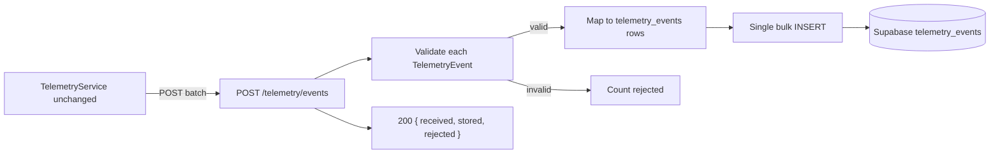

# Company's Telemetry – Storage — Reference Solution

This reference solution defines the expected quality bar for Phase 3 in the student's company monorepo fork. The frontend from Phase 2 must remain **unchanged** — only the backend `POST /telemetry/events` implementation and Supabase schema are in scope.

---

## Architecture overview



**Design invariant:** same URL, same request body, same HTTP 200 on success — `TelemetryService` ignores response body.

---

## Phase 1 — `telemetry_events` table (Supabase)

### Column schema

| Column       | Type          | Constraints                     | Purpose                                |
| ------------ | ------------- | ------------------------------- | -------------------------------------- |
| `id`         | `uuid`        | PK, default `gen_random_uuid()` | Row id                                 |
| `timestamp`  | `timestamptz` | NOT NULL                        | Event time (from envelope)             |
| `service`    | `text`        | NOT NULL                        | Origin: `backoffice`, `api`, etc.      |
| `event_type` | `text`        | NOT NULL                        | `entity_action` event type             |
| `level`      | `text`        | default `'info'`                | `info`, `warn`, `error`                |
| `value`      | `numeric`     | nullable                        | Optional metric                        |
| `message`    | `text`        | nullable                        | Human-readable summary                 |
| `tags`       | `jsonb`       | default `'{}'`                  | Envelope `properties` (allowlist only) |

### Required indexes

```sql
CREATE INDEX idx_telemetry_events_timestamp ON telemetry_events (timestamp);
CREATE INDEX idx_telemetry_events_event_type ON telemetry_events (event_type);
CREATE INDEX idx_telemetry_events_tags ON telemetry_events USING GIN (tags);
```

### Immutability

- No UPDATE or DELETE paths in application code for this table.
- Events are append-only facts.

### Mapping from `TelemetryEvent` envelope

Indicative row mapping (adjust `service`/`level` rules to match student plan):

| DB column    | Source                                         |
| ------------ | ---------------------------------------------- |
| `timestamp`  | `event.timestamp`                              |
| `service`    | constant `backoffice` or derived from envelope |
| `event_type` | `event.event_type`                             |
| `level`      | derive from event type or default `info`       |
| `value`      | optional numeric from `properties` if defined  |
| `message`    | optional string summary                        |
| `tags`       | `event.properties` (allowlist keys only)       |

Envelope fields `eventId`, `sessionId`, `userId`, `schemaVersion`, and `requestId` may also live inside `tags` if the Phase 1 plan requires them for analytics — document the mapping consistently.

---

## Phase 2 — Real `POST /telemetry/events` endpoint

### Behaviour

1. Accept `{ "events": TelemetryEvent[] }` — **same contract as stub**
2. Validate each event with the **unchanged** `TelemetryEvent` Pydantic model from Phase 2
3. Invalid events increment `rejected` — **do not abort** the batch
4. Valid events collected and inserted via **one bulk insert** (single transaction)
5. Return HTTP `200`:

```json
{
  "received": 5,
  "stored": 4,
  "rejected": 1
}
```

### Partial batch handling (indicative logic)

```python
valid_rows: list[dict] = []
rejected = 0

for raw in payload.events:
    try:
        event = TelemetryEvent.model_validate(raw)
        valid_rows.append(map_event_to_row(event))
    except ValidationError:
        rejected += 1

stored = 0
if valid_rows:
    stored = repository.bulk_insert_telemetry(valid_rows)  # single DB operation

return {"received": len(payload.events), "stored": stored, "rejected": rejected}
```

### Bulk insert requirement

- **Pass:** `INSERT INTO telemetry_events (...) VALUES (...), (...), ...` or ORM `bulk_insert_mappings` in one commit
- **Fail:** loop of 20 separate `INSERT` statements per batch

### Frontend compatibility

- Endpoint path unchanged (`/telemetry/events`)
- Still returns `200` on successful processing
- `TelemetryService` retry logic must not break — transient 5xx should remain rare

---

## Phase 3 — End-to-end verification

### Live backoffice test

1. Start backend with real endpoint + Supabase connection
2. In backoffice: create one inbound order and one outbound order
3. Query Supabase:

```sql
SELECT event_type, timestamp, tags
FROM telemetry_events
ORDER BY timestamp DESC
LIMIT 20;
```

Expect ≥5 rows with populated `event_type`, `timestamp`, `tags`.

### Mixed batch curl test

```bash
curl -s -X POST "$TELEMETRY_URL/telemetry/events" \
  -H "Content-Type: application/json" \
  -d '{
    "events": [
      {
        "eventId": "550e8400-e29b-41d4-a716-446655440000",
        "timestamp": "2026-06-15T12:00:00Z",
        "sessionId": "sess_demo",
        "userId": "user_1",
        "event_type": "outbound_order_created",
        "schemaVersion": "1.0.0",
        "requestId": "req_demo",
        "properties": { "orderId": "o1", "productId": "p1", "quantity": 2 }
      },
      {
        "eventId": "not-a-uuid",
        "timestamp": "bad",
        "sessionId": "",
        "userId": "",
        "event_type": "",
        "schemaVersion": "",
        "requestId": "",
        "properties": {}
      }
    ]
  }'
```

Expected: `{ "received": 2, "stored": 1, "rejected": 1 }` and one new row in `telemetry_events`.

---

## PR deliverables

- Screenshot: Supabase table with ≥5 real event rows
- JSON response from mixed valid/invalid batch
- Explicit statement: **no frontend file changes**

---

## Common mistakes (incomplete submissions)

- One INSERT per event instead of bulk
- Entire batch fails when one event is invalid
- Modified `TelemetryEvent` model breaking Phase 2 contract
- Frontend changes to parse new response body
- Missing GIN index on `tags`
- UPDATE/DELETE endpoints for telemetry rows
- `tags` empty while `properties` had allowlisted data

---

## Evaluation checklist

- [ ] `telemetry_events` table with 8 columns + 3 indexes, write-only
- [ ] Bulk insert in single operation per batch
- [ ] Response `{ received, stored, rejected }`
- [ ] Per-event validation; partial batch persistence
- [ ] `TelemetryEvent` model reused unchanged from Phase 2
- [ ] Zero frontend diffs
- [ ] Supabase rows show `event_type`, `timestamp`, `tags`
- [ ] PR title `[W16D48] Telemetry Storage` with required evidence

---

## Reviewer notes

- `service` and `level` derivation may vary — grade consistency, not a single hardcoded value.
- Accept Supabase SQL migration file or dashboard-created schema if indexes are documented.
- Phase 4 analytics project will query this table — fixed columns must support time-range and `event_type` filters.
