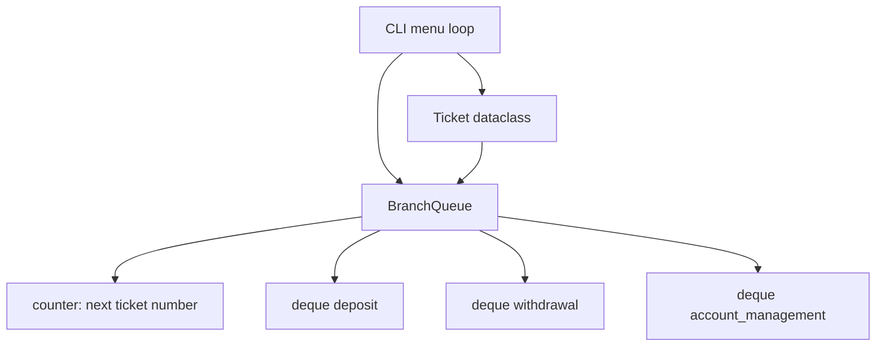

# Branch Queue — Tagged Service Queue — Reference Solution

This reference solution describes the expected architecture, implementation scope, and validation evidence for a complete submission. The deliverable is a **standalone terminal Python program** — no web UI, no external packages.

---

## Expected file layout

| File                             | Purpose                                                   |
| -------------------------------- | --------------------------------------------------------- |
| `branch_queue.py`                | Entry point: `Ticket`, `BranchQueue`, and CLI menu loop   |
| `DESIGN.md` (or inline comments) | Per-service queue rationale and concurrent-mutation notes |

---

## Architecture overview



**Separation rule:** queue logic lives in `BranchQueue`; the CLI only parses input and calls queue methods. No business logic in `main()` beyond menu dispatch.

---

## Data model — `Ticket`

Minimum fields:

| Field          | Type       | Notes                                                      |
| -------------- | ---------- | ---------------------------------------------------------- |
| `number`       | `int`      | Global sequential counter (1, 2, 3, … across all services) |
| `client_name`  | `str`      | Client identifier                                          |
| `service_type` | `str`      | `"deposit"`, `"withdrawal"`, or `"account_management"`     |
| `issued_at`    | `datetime` | Set at issuance via `datetime.now()`                       |

Use `@dataclass` with `__repr__` for readable CLI output.

---

## `BranchQueue` — recommended internal design

**Three `collections.deque` instances** — one per service type — plus a global ticket counter:

```python
from collections import deque

SERVICE_TYPES = ("deposit", "withdrawal", "account_management")

class BranchQueue:
    def __init__(self):
        self._next_number = 1
        self._queues = {svc: deque() for svc in SERVICE_TYPES}
```

| Operation                     | Behavior                                                    | Complexity |
| ----------------------------- | ----------------------------------------------------------- | ---------- |
| `issue_ticket(name, service)` | Increment counter, build `Ticket`, append to matching deque | O(1)       |
| `call_next(service_type)`     | `popleft` from that service deque                           | O(1)       |
| `peek_next(service_type)`     | Index `[0]` of that deque                                   | O(1)       |
| `list_waiting()`              | Dict of each service → list copy of its deque               | O(n)       |
| `stats()`                     | Per-service counts + `"total"` sum                          | O(1)       |

### Why one deque per service type

| Alternative           | Drawback                                                                               |
| --------------------- | -------------------------------------------------------------------------------------- |
| Single shared list    | `call_next` must scan all waiting clients to find next for one service — O(n) per call |
| Single deque + filter | Same scan cost; agents block each other conceptually                                   |
| Sort on every insert  | O(n log n) per ticket; unnecessary for three fixed service lanes                       |

Per-service deques give O(1) `call_next` regardless of how many clients wait for other services.

### Invalid service type

Reject at `issue_ticket` with a clear message (or raise `ValueError`). CLI catches and re-prompts.

### Empty queue handling

Raise a custom exception (e.g., `QueueEmptyError`) or return `None` — **the CLI must catch it** and print a user-friendly message.

---

## CLI menu — expected behavior

```text
=== Branch Queue Manager ===
1. Issue ticket
2. Call next client
3. View waiting list
4. Queue stats
5. Exit
Choice:
```

- Option 2 prompts for service type before calling `call_next`.
- Invalid service type or menu input: re-prompt, do not crash.
- Option 2 on empty service queue: print "No clients waiting for {service}" (or equivalent).

### Indicative session

```text
=== Branch Queue Manager ===
1. Issue ticket
2. Call next client
3. View waiting list
4. Queue stats
5. Exit
Choice: 1
Client name: Ana Ruiz
Service (deposit / withdrawal / account_management): deposit
Ticket #1 issued for Ana Ruiz (deposit).

Choice: 1
Client name: Luis Pérez
Service (deposit / withdrawal / account_management): withdrawal
Ticket #2 issued for Luis Pérez (withdrawal).

Choice: 3
Waiting by service:
  deposit: [#1 Ana Ruiz]
  withdrawal: [#2 Luis Pérez]
  account_management: []

Choice: 2
Service to call: deposit
Calling ticket #1 — Ana Ruiz (deposit)

Choice: 4
Queue stats: {deposit: 0, withdrawal: 1, account_management: 0, total: 1}
```

---

## Design note — concurrent `call_next`

When two agents of the **same** service type share one queue:

1. **Serialize mutations** with a lock (`threading.Lock` in-process; row lock or atomic pop in production).
2. **`call_next` order:** acquire lock → read front ticket → `popleft` → release lock.
3. **`issue_ticket` order:** acquire lock → increment counter → append to deque → release lock.

Without atomic dequeue under the lock, both agents could read the same front ticket before either removes it — double-calling the same client. Document this informally in `DESIGN.md`.

---

## Validation evidence

A complete submission should demonstrate:

1. Ticket numbers are globally sequential across different service types.
2. Two `deposit` clients are called in strict arrival order.
3. `call_next("deposit")` does not affect the `withdrawal` queue.
4. `call_next()` / `peek_next()` on empty service queue handled gracefully in CLI.
5. Invalid service type rejected at ticket issuance.
6. `list_waiting()` groups tickets by service in FIFO order within each group.
7. `stats()` counts match visible queue contents and include `"total"`.
8. `DESIGN.md` explains per-service deque efficiency vs single shared list.
9. `DESIGN.md` addresses concurrent `call_next` mutation order.

---

## Common mistakes (incomplete submissions)

- One list for all clients — `call_next` scans entire waiting room every time.
- Ticket counter reset per service type — numbers must be global.
- `peek_next` mutates the queue (uses `popleft` instead of `[0]`).
- Logic dumped entirely in `main()` with no `BranchQueue` class.
- External packages when rubric requires stdlib only.
- No error handling for empty queue or invalid service type.

---

## Evaluation checklist

- [ ] `Ticket` model with `number`, `client_name`, `service_type`, `issued_at`
- [ ] `BranchQueue` with one internal deque per service type
- [ ] All five operations implemented correctly
- [ ] Global sequential ticket numbers; FIFO within each service queue
- [ ] CLI menu functional with graceful error handling
- [ ] Design note on per-service queue efficiency
- [ ] Design note on concurrent `call_next` scenario
- [ ] Stdlib only (`collections.deque`, `datetime`)
