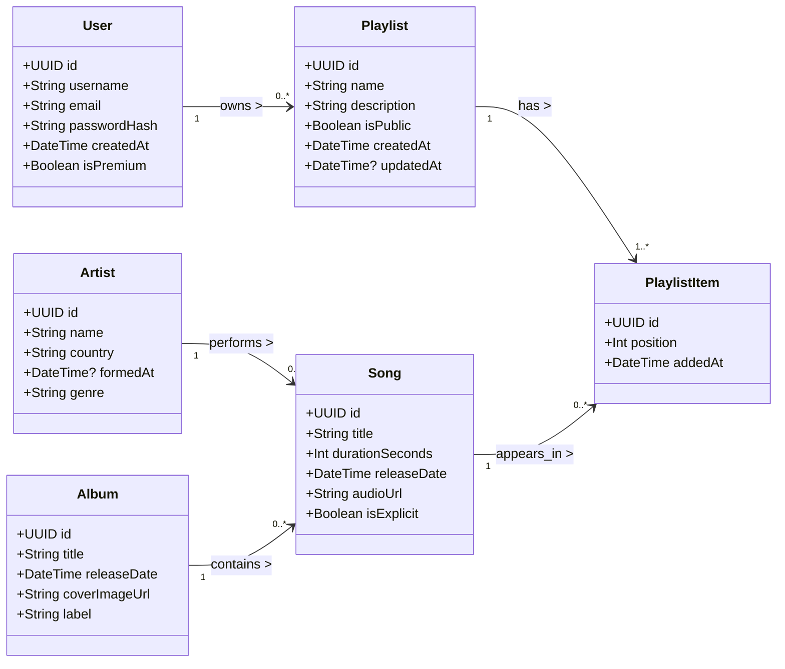
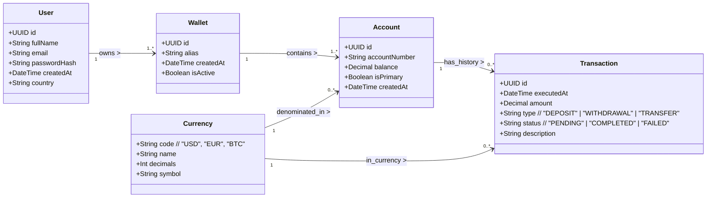

# Data modeling and class diagrams – Solution

This document shows one possible **reference solution** for the project, using **Mermaid class diagrams** for both required exercises:

- A **music playlist player**.
- A **digital wallet** with transaction history.

The focus is on **clear entities, typed properties, and explicit relationships**, so that these diagrams could be implemented later in code or a database.

---

## 1. Music playlist player – Class diagram

### 1.1. Design overview

Key design decisions:

- A `User` can own multiple `Playlist` objects.
- Each `Playlist` contains many `PlaylistItem` elements, which:
  - Link a single `Song` to the playlist.
  - Store the **position** of the song inside the playlist.
  - Store when the song was **added**.
- A `Song` belongs to one `Album` and is performed by one `Artist` (this can be extended to many‑to‑many if needed).

This satisfies the requirement of **at least 5 models** with **typed properties** and clear relationships.

### 1.2. Mermaid diagram

---

## 2. Digital wallet – Class diagram

### 2.1. Design overview

Key design decisions:

- A `User` can own one or more `Wallet` instances (for example, "Personal", "Business").
- Each `Wallet` contains one or more `Account` objects, typically one per `Currency`.
- A `Transaction` represents a single movement of money (deposit, withdrawal, transfer) on an `Account`.
- `Currency` is modeled as a separate entity to centralize code, name, decimals, and symbol.

This satisfies the requirement of **at least 3 entities**, typed properties, and a **transaction history**.

### 2.2. Mermaid diagram

---

## 3. How students can vary their solutions

Students do **not** have to match this solution exactly. Some acceptable variations include:

- Adding more properties (e.g. `lastLoginAt` on `User`, `favorite` flag on `Playlist`, fees on `Transaction`).
- Splitting concepts further (e.g. separate `Artist` and `Band`, or modeling `Transfer` as two `Transaction` records).
- Using slightly different data types where justified (e.g. using `BigDecimal` in strongly-typed languages for money).

What matters is that:

- All required entities are present.
- Every property has a **clear data type**.
- Relationships between entities are **explicit and coherent**.
- The diagrams could realistically guide an actual implementation.
