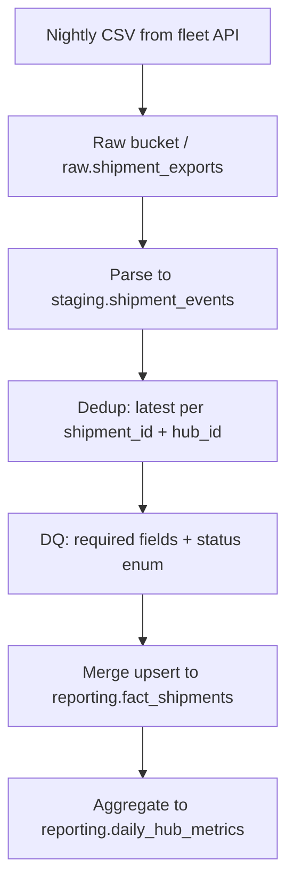

# Pipeline Design Document — Veridian Logistics (Reference Excerpt)

> Instructor/evaluator reference only. Student deliverable: `PIPELINE_DESIGN.md` at repository root.

## Purpose

Veridian's fleet system exports nightly CSV files where shipment status changes appear as **new rows** rather than updates. Operations dashboards that sum "in transit" shipments count the same package multiple times. This pipeline ingests nightly exports and produces:

- `reporting.fact_shipments` — one current row per `(shipment_id, hub_id)`
- `reporting.daily_hub_metrics` — hub-level KPIs (dispatches, deliveries, avg transit time)

Consumers: operations BI (Looker/Metabase), weekly SLA review with hub managers.

## Data Format Analysis

**CSV at source:** Appropriate for the current export contract — no upstream change required. Weaknesses: no embedded schema, repeated headers across hubs if concatenated, and full-file scans for reprocessing.

**Recommendation:**

| Zone        | Format                       | Why                                                     |
| ----------- | ---------------------------- | ------------------------------------------------------- |
| Raw landing | CSV (immutable)              | Audit trail matches source                              |
| Staging     | Parquet or typed SQL staging | Columnar storage for 5-hub scale growth; enforced types |
| Reporting   | SQL tables                   | BI compatibility                                        |

At today's volume (~50k rows/night), CSV landing is acceptable; Parquet in staging avoids re-parsing text on every dedup logic change.

## Data Flow Diagram

Dedup occurs at **D**. Idempotent commit at **F**.

## Deduplication Strategy

- Business key: `(shipment_id, hub_id)`.
- Order rows by `event_timestamp DESC`; keep first row per partition.
- Process **all files in the batch** together so cross-night duplicates resolve.
- Quarantine rows with null `shipment_id` to `staging.quarantine` with `run_id`.

## Idempotency Plan

1. Assign `run_id` at job start; log to `pipeline_runs`.
2. Phases: `extract` → `stage` → `dedup` → `load` — store `checkpoint` after each.
3. Load uses transactional `MERGE` into `fact_shipments` on business key.
4. On failure during load: transaction rolls back; retry resumes from `load` using staged dedup output keyed by `run_id`.
5. Re-running the same `source_file` set produces identical fact rows (merge is upsert, not blind insert).

## Execution Log Specification

Each run appends one row to `pipeline_runs`:

| Field              | Example                     | Why                              |
| ------------------ | --------------------------- | -------------------------------- |
| `run_id`           | `a1b2c3d4-...`              | Trace one execution end-to-end   |
| `started_at`       | `2026-06-18T02:15:00Z`      | Schedule adherence               |
| `source_files`     | `["hub-east-20260617.csv"]` | Prove which export was processed |
| `rows_extracted`   | `48210`                     | Detect truncated exports         |
| `rows_after_dedup` | `39102`                     | Quantify duplicate pressure      |
| `rows_loaded`      | `39102`                     | Reconcile with merge count       |
| `status`           | `success`                   | Alerting                         |
| `pipeline_version` | `1.2.0`                     | Debug logic changes              |

## Robustness Criteria

1. **Quarantine path** for schema violations — never fail silently or drop rows without audit.
2. **Anomaly alerts** when `rows_extracted` deviates >30% from 7-day median.
3. **Raw retention 90 days** with documented reprocess procedure for dedup rule changes.
