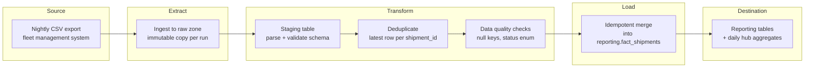

# Designing a Data Pipeline — Reference Solution

This reference solution defines the expected quality bar for `PIPELINE_DESIGN.md` at the repository root. The deliverable is **design documentation only** — no Python scripts, migrations, or runnable ETL code.

Another engineer should be able to implement the pipeline from this document without follow-up questions.

## Deliverable structure

`PIPELINE_DESIGN.md` must include all sections required by the student README:

| Section                         | What a strong submission covers                                                                                                                             |
| ------------------------------- | ----------------------------------------------------------------------------------------------------------------------------------------------------------- |
| **Purpose**                     | Business problem (duplicate/mis-aggregated shipment metrics), pipeline outputs (clean fact table, daily hub KPIs), and consumers (ops dashboards, finance). |
| **Data format analysis**        | CSV strengths/limits for nightly flat exports; when to convert (e.g. Parquet in lake/staging); trade-offs on schema evolution, compression, and query cost. |
| **Data flow diagram**           | Source → extract → transform → load → destination with labeled stages and where deduplication/idempotency occur.                                            |
| **Deduplication strategy**      | Natural/business key (`shipment_id` + `hub_id`), window or `ROW_NUMBER()` by `event_timestamp`, keep latest lifecycle state; handle late-arriving rows.     |
| **Idempotency plan**            | Staging + merge/upsert, run checkpoints, transactional load boundaries, safe re-run after partial failure.                                                  |
| **Execution log specification** | ≥5 auditable fields with rationale (see table below).                                                                                                       |
| **Robustness criteria**         | ≥3 concrete production traits (monitoring, data quality checks, alerting, backfill strategy, schema contracts).                                             |

Optional but valuable: **client discovery questions** (Phase 1) as a short appendix.

---

## Pipeline architecture (reference)

**Key decisions annotated on the diagram:**

- Raw zone keeps every nightly file unchanged (audit + replay).
- Deduplication happens **after** staging, **before** merge to reporting.
- Merge uses `shipment_id` + `hub_id` as the business key with `event_timestamp` for conflict resolution.

---

## Indicative example — Purpose (strong vs weak)

**Strong:**

> Veridian exports mix new dispatches and lifecycle updates as separate CSV rows for the same `shipment_id`. Loading blindly double-counts shipments in transit and inflates delivery SLA metrics. This pipeline produces `reporting.fact_shipments` (one current row per shipment per hub) and `reporting.daily_hub_metrics` (aggregates on deduplicated state) for the operations BI layer.

**Weak (incomplete):**

> The pipeline loads CSV data into a database for reports.

---

## Indicative example — Data format analysis

| Stage         | Format                                         | Rationale                                              |
| ------------- | ---------------------------------------------- | ------------------------------------------------------ |
| Landing / raw | CSV (as delivered)                             | Preserve source fidelity; no upstream change required. |
| Staging       | Columnar (Parquet) or typed relational staging | Cheaper scans at scale; enforced types before merge.   |
| Reporting     | Relational (warehouse tables)                  | BI tools expect SQL-friendly star/summary tables.      |

Trade-off to mention: CSV is fine for nightly batch volume at Veridian's scale today, but Parquet in the lake reduces storage and speeds reprocessing when dedup logic changes.

---

## Indicative example — Deduplication strategy

**Constraint:** updates arrive as new inserts, not in-place updates.

**Approach:**

1. Parse each nightly file into `staging.shipment_events` with `ingest_run_id`, `source_file`, `row_number`.
2. Define business key: `(shipment_id, hub_id)`.
3. For each key, keep the row with the **maximum** `event_timestamp` (or `status_sequence` if provided).
4. Rows with equal timestamps: deterministic tie-breaker (`source_file` line order or `export_batch_id`).

**Late arrivals:** if a row for an older date appears in a newer file, the max-timestamp rule still wins — document that reporting may need a **backfill window** (e.g. reprocess last 7 days).

**Common mistake:** deduplicating only within a single file — duplicates across nights remain.

---

## Indicative example — Idempotency plan

**Failure scenario:** pipeline fails after loading 60% of deduplicated rows into `reporting.fact_shipments`.

**Recovery:**

1. Each run has a unique `run_id` logged at start.
2. Load phase writes to `staging.load_batch_<run_id>` or uses a **staging merge** pattern, not direct partial commits without markers.
3. Final merge into `fact_shipments` is a single **transactional upsert** (`INSERT ... ON CONFLICT DO UPDATE` or equivalent).
4. `pipeline_runs` table stores `status`, `checkpoint` (last completed phase), and `rows_committed`.
5. On retry: if `status = failed` and `checkpoint = post_dedup`, skip extract/transform and resume from load; if failure was mid-transaction, rollback left no partial facts (or use merge idempotency on `run_id`).

**Common mistake:** "re-run the whole job" without explaining how already-committed rows are not duplicated.

---

## Execution log — minimum fields (reference)

| Field                        | Type                                  | Rationale                                              |
| ---------------------------- | ------------------------------------- | ------------------------------------------------------ |
| `run_id`                     | UUID                                  | Correlate logs, metrics, and alerts for one execution. |
| `started_at` / `finished_at` | ISO 8601 UTC                          | SLA tracking, duration trends, incident timelines.     |
| `source_files`               | string[]                              | Audit which nightly exports were processed.            |
| `rows_extracted`             | integer                               | Detect empty or truncated source files.                |
| `rows_after_dedup`           | integer                               | Measure duplicate pressure from updates-as-inserts.    |
| `rows_loaded`                | integer                               | Reconcile with reporting table counts.                 |
| `status`                     | enum (`success`, `failed`, `partial`) | Automation and paging rules.                           |
| `error_summary`              | string (nullable)                     | Human-readable failure without scraping stack traces.  |
| `pipeline_version`           | semver / git sha                      | Reproducibility when logic changes.                    |

At least **five** fields with justification are required by the rubric; the table above exceeds that bar.

---

## Indicative example — Robustness criteria

1. **Schema contract tests** — reject files missing `shipment_id`, `hub_id`, `status`, or with unknown status values; quarantine bad files instead of silent load.
2. **Observability** — metrics on row counts, dedup ratio, and run duration; alert if `rows_extracted` drops >30% day-over-day.
3. **Replayability** — raw files retained N days; ability to reprocess a date range without manual one-off scripts.
4. **Ownership & runbook** — documented on-call steps for failed runs (not listed in rubric minimum but strengthens production readiness).

**Weak criteria:** "good code", "fast", "secure" without pipeline-specific meaning.

---

## Client discovery questions (Phase 1 — indicative)

Strong submissions list questions such as:

1. What is the stable business key for a shipment across hubs and re-routes?
2. Is `event_timestamp` source-generated and trustworthy for ordering lifecycle updates?
3. What is the acceptable latency between nightly export and dashboard refresh?
4. Are deletes or cancellations exported, or only status progressions?
5. What volume growth is expected per hub in 12 months (format/architecture scaling)?

---

## Validation checklist (for evaluators)

- [ ] `PIPELINE_DESIGN.md` exists at repo root; no implementation code added.
- [ ] Purpose ties to Veridian's duplicate-row problem and names concrete outputs.
- [ ] Format analysis recommends alternatives with trade-offs, not format definitions only.
- [ ] Diagram covers extract → transform → load with dedup/idempotency placement.
- [ ] Dedup addresses **cross-file** updates-as-inserts, not generic DISTINCT.
- [ ] Idempotency describes a **concrete** recovery mechanism (staging, upsert, checkpoints).
- [ ] Log spec has ≥5 fields, each justified.
- [ ] Robustness criteria are actionable and pipeline-specific.
- [ ] Decisions include trade-off reasoning throughout.

---

## Auxiliary reference

See `PIPELINE_DESIGN.example.md` in this folder for a condensed sample document illustrating tone and depth. Students should write their own design in the repository root — do not copy verbatim.
