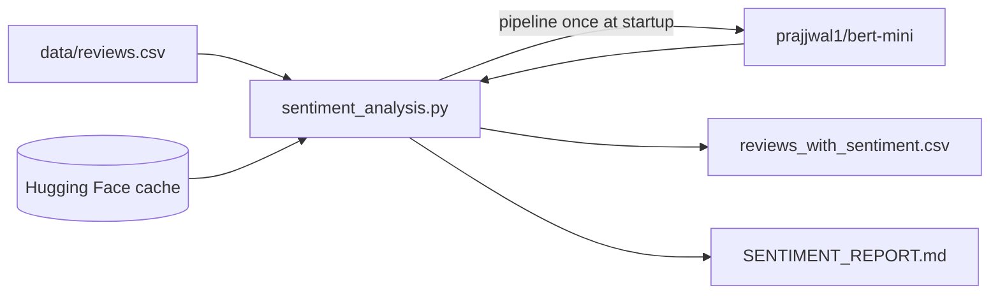

# Sentiment Analysis on Customer Reviews — WeLoveReviews — Reference Solution

This reference solution describes the expected architecture, deliverables, and validation evidence for a complete submission. Students integrate an existing Hugging Face model — they do **not** train or fine-tune one.

---

## Expected file layout

| File                                    | Purpose                                                               |
| --------------------------------------- | --------------------------------------------------------------------- |
| `requirements.txt` or `pyproject.toml`  | Pinned dependencies (`transformers`, `torch`, `pandas`, etc.)         |
| `data/reviews.csv`                      | Input dataset (500 reviews with `review_id`, `rating`, `review_text`) |
| `sentiment_analysis.py` (or equivalent) | Loads model once, runs inference, writes outputs                      |
| `output/reviews_with_sentiment.csv`     | Each review with predicted label and confidence score                 |
| `SENTIMENT_REPORT.md`                   | Client-ready report for the account manager                           |

---

## Architecture overview



**Critical rule:** Load the model **once** before the inference loop. Never call `pipeline()` or `from_pretrained()` inside the per-review loop.

---

## Model integration

Pin the model identifier as a constant:

```python
MODEL_NAME = "prajjwal1/bert-mini"
```

Load via `transformers.pipeline`:

```python
from transformers import pipeline

classifier = pipeline("sentiment-analysis", model=MODEL_NAME)
```

> **Note:** `prajjwal1/bert-mini` is a general BERT checkpoint. For production sentiment work you would choose a model fine-tuned on sentiment (e.g. SST-2). This project tests integration discipline — students must validate outputs manually regardless of model choice.

First run downloads weights to `~/.cache/huggingface`. Do **not** commit model binaries to the repository.

---

## Processing pipeline

1. Read `data/reviews.csv` with pandas or the stdlib `csv` module.
2. Load the classifier once.
3. For each `review_text`, run inference and store:
   - `predicted_label` (e.g. `POSITIVE`, `NEGATIVE`, `NEUTRAL` — depends on model output)
   - `confidence` score if available
4. Write enriched CSV to `output/reviews_with_sentiment.csv`.
5. Compute breakdown: count and percentage per sentiment label.
6. Compare against the 4.5-star average:
   - Calculate mean star rating from the `rating` column.
   - Map star ratings to expected sentiment bands (e.g. 4–5 → mostly positive, 3 → neutral, 1–2 → negative).
   - Identify gaps (e.g. high star average but significant negative sentiment labels).

---

## Manual validation (required)

Students must inspect **at least 15–20 reviews** by hand and document findings in `SENTIMENT_REPORT.md`:

| review_id | rating | review_text (truncated)                              | predicted_label | manual_label | match?  | notes                      |
| --------- | ------ | ---------------------------------------------------- | --------------- | ------------ | ------- | -------------------------- |
| 9         | 3      | "Average sandwiches, nothing to write home about..." | NEGATIVE        | NEUTRAL      | partial | Model over-weighted "slow" |
| 10        | 5      | "staff seemed annoyed... food made up for it"        | POSITIVE        | MIXED        | no      | Mixed sentiment missed     |

This table is evidence the student did not blindly trust model output.

---

## Report structure (`SENTIMENT_REPORT.md`)

A complete report includes:

1. **Executive summary** — one paragraph a non-technical account manager can forward.
2. **Dataset overview** — 500 reviews, mean star rating, date/source context.
3. **Sentiment breakdown** — table or bullet list with counts and percentages.
4. **Comparison to star rating** — does sentiment align with 4.5 average? Where does it diverge?
5. **Discrepancy analysis** — hypotheses (sarcasm, mixed reviews, rating inflation, model domain mismatch).
6. **Manual validation sample** — 15–20 reviewed examples with notes.
7. **Recommendation** — what the account manager should tell the client.

---

## Indicative examples

### Example: sentiment breakdown output

```
Total reviews analyzed: 500
Mean star rating: 4.48 / 5

Sentiment breakdown:
  POSITIVE: 412 (82.4%)
  NEUTRAL:   58 (11.6%)
  NEGATIVE:  30 ( 6.0%)
```

### Example: discrepancy finding

> The business averages 4.5 stars, and 82% of reviews classify as positive — broadly aligned. However, 18 reviews rated 4–5 stars received a NEGATIVE sentiment label. Manual inspection suggests these contain backhanded compliments or complaints buried in otherwise positive text (e.g. review_id 10, 17).

### Example: enriched CSV row

```csv
review_id,rating,review_text,predicted_label,confidence
1,5,"Visited Harbor House Café last weekend...",POSITIVE,0.97
```

---

## Validation checklist

- [ ] Model loaded via `pipeline()` / `from_pretrained()` — no weights in repo
- [ ] `MODEL_NAME` pinned as constant — not resolved to "latest"
- [ ] Model instantiated once, reused for all 500 reviews
- [ ] All 500 reviews have a sentiment prediction
- [ ] Sentiment breakdown calculated with percentages
- [ ] Explicit comparison to 4.5-star average
- [ ] 15–20 manually reviewed examples documented
- [ ] `SENTIMENT_REPORT.md` is client-ready (non-technical language)
- [ ] Dependencies pinned in `requirements.txt`

---

## Key implementation decisions

- **Separation of concerns:** Keep data loading, inference, aggregation, and report generation in distinct functions for clarity and testability.
- **Load model once:** Instantiate the classifier before the review loop — never call `pipeline()` or `from_pretrained()` inside the per-review loop.
- **Pin model version:** Constant `MODEL_NAME = "prajjwal1/bert-mini"` — not `"latest"`.
- **Cache:** First run downloads to `~/.cache/huggingface`; subsequent runs reuse cache.
- **Report in repo:** `SENTIMENT_REPORT.md` committed — not only stdout.
