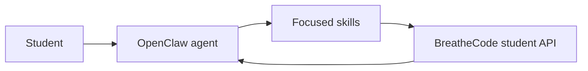

# OpenClaw Integration — Reference Solution

## Purpose

This project has no single “correct” codebase. The deliverable is conversational work inside OpenClaw plus a written **skill log**. This document describes what a complete submission looks like and how evaluators can verify it.

## Expected deliverable structure

- **`SKILL_LOG.md`** (student-owned GitHub repo or attachment per instructor): one section per skill with:
  - The natural-language prompt that started the conversation
  - What the skill does and which BreatheCode / 4Geeks API endpoints it targets (one primary concern per skill)
  - Evidence of a successful test (redacted token values; paste API snippets or describe the agent reply)

- **OpenClaw configuration**: student token stored only via OpenClaw’s secure secret mechanism — never committed in skill files or in `SKILL_LOG.md`.

## Skill coverage (minimum)

1. **Authenticate** — Verify the student token is accepted (e.g. identity / “me” style call consistent with your cohort’s API usage).
2. **List my projects** — Return assigned projects with status (pending, submitted, graded) as exposed by the assignments API.
3. **Pending work** — Answer what still needs completion from task / assignment data.
4. **Progress summary** — High-level view of advancement in the course from the same APIs.

Plus **at least two** additional skills the student chose (each still mapped to a narrow API concern).

## Architecture (conceptual)



Each skill should be a thin wrapper around **one** API action (or a tightly related pair), so the agent can compose them in conversation instead of one oversized “do everything” skill.

## Indicative examples

### Acceptable `SKILL_LOG.md` excerpt (sanitized)

```markdown
## Skill: List my tasks

**Prompt:** “Help me call the student tasks endpoint with my token from env.”

**Endpoints:** `GET /v1/assignment/user/me/task` (with cohort filter as needed).

**Test:** Agent returned 12 tasks; first item showed `task_status` PENDING and matching `title` from the LMS. Token not printed.
```

### Common mistakes (incomplete)

- One skill that both submits homework and fetches certificates.
- Token pasted inside a skill markdown file or committed to GitHub.
- Log entry with no test evidence or no endpoint named.

## Validation notes

- Confirm at least six documented skills (four core + two extended) with tests.
- Confirm the conversational process is reflected in the log (iterations, refinements).
- Cross-check a sample response against the [student API calls reference](../../STUDENT_API_CALLS_REFERENCE.md) for the cohort’s base URL and query parameters.
