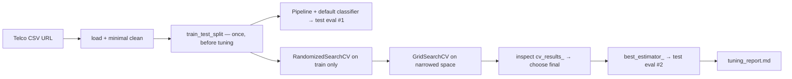

# StreamLoop — Tuning the Churn Model — Reference Solution

This reference solution describes the expected architecture, deliverables, and validation evidence for a complete submission. Students tune an existing-style churn classifier on the IBM Telco dataset — they do **not** need a specific algorithm; the tuning process and reasoning are what matter.

---

## Expected file layout

| File                                   | Purpose                                                                                    |
| -------------------------------------- | ------------------------------------------------------------------------------------------ |
| `requirements.txt` or `pyproject.toml` | Pinned dependencies (`scikit-learn`, `pandas`, `numpy`, etc.)                              |
| `churn_tuning.ipynb` (or equivalent)   | Full workflow: load, split, baseline, search, final evaluation                             |
| `tuning_report.md`                     | Baseline vs tuned comparison, final hyperparameters, metric rationale, stability trade-off |

---

## Architecture overview



**Critical rule:** The test set is evaluated **exactly twice** — baseline and final tuned model. `RandomizedSearchCV` and `GridSearchCV` must call `.fit(X_train, y_train)` only.

---

## Data loading and cleaning

Dataset URL (load in notebook — no manual download required):

```
https://raw.githubusercontent.com/IBM/telco-customer-churn-on-icp4d/master/data/Telco-Customer-Churn.csv
```

Minimum cleaning expectations:

- Drop `customerID` (identifier, not predictive).
- Replace blank strings in `TotalCharges` with `NaN`, then impute or drop with a one-line justification.
- Encode target `Churn`: `Yes` → 1, `No` → 0.
- Split **before** any fit that learns from data:

```python
from sklearn.model_selection import train_test_split

X = df.drop(columns=["Churn", "customerID"])
y = (df["Churn"] == "Yes").astype(int)

X_train, X_test, y_train, y_test = train_test_split(
    X, y, test_size=0.2, random_state=42, stratify=y
)
```

---

## Pipeline (all preprocessing inside)

Preprocessing must live in a `Pipeline` so CV folds never leak statistics from validation rows:

```python
from sklearn.compose import ColumnTransformer
from sklearn.pipeline import Pipeline
from sklearn.preprocessing import OneHotEncoder
from sklearn.impute import SimpleImputer
from sklearn.ensemble import RandomForestClassifier  # example — any classifier OK

numeric_features = ["tenure", "MonthlyCharges", "TotalCharges"]
categorical_features = [c for c in X.columns if c not in numeric_features]

preprocessor = ColumnTransformer(
    transformers=[
        ("num", SimpleImputer(strategy="median"), numeric_features),
        (
            "cat",
            Pipeline([
                ("imputer", SimpleImputer(strategy="most_frequent")),
                ("encoder", OneHotEncoder(handle_unknown="ignore")),
            ]),
            categorical_features,
        ),
    ]
)

baseline_pipeline = Pipeline([
    ("preprocess", preprocessor),
    ("classifier", RandomForestClassifier(random_state=42)),
])
```

> **Do not** fit `OneHotEncoder` or imputers on the full dataset before splitting. Fitting the pipeline on `X_train` is correct; fitting transformers on all of `X` before split is leakage.

---

## Baseline (test touch #1)

```python
baseline_pipeline.fit(X_train, y_train)
baseline_score = SCORER(baseline_pipeline, X_test, y_test)
```

Record the score and metric name in the notebook and in `tuning_report.md`.

---

## Scoring metric (business-aligned)

StreamLoop loses more from **missed churners** than from unnecessary retention offers. Accuracy is a weak default here because the classes are imbalanced and false negatives are costly.

Defensible choices (student must **state why** in the report):

| Metric                    | When it fits                                                  |
| ------------------------- | ------------------------------------------------------------- |
| `recall` (positive class) | Prioritize catching churners; accept more false positives     |
| `f1`                      | Balance precision and recall when retention cost also matters |
| `average_precision`       | Useful when ranking at-risk customers                         |

Example:

```python
SCORING = "recall"  # document: "Missing churn costs more than extra retention outreach"
```

Using default accuracy without justification does **not** meet the rubric.

---

## Hyperparameter search (train only)

### Step 1 — RandomizedSearchCV (broad, cheap)

```python
from sklearn.model_selection import RandomizedSearchCV

param_distributions = {
    "classifier__n_estimators": [100, 200, 300, 500],
    "classifier__max_depth": [None, 10, 20, 30],
    "classifier__min_samples_split": [2, 5, 10],
    "classifier__class_weight": [None, "balanced"],
}

random_search = RandomizedSearchCV(
    baseline_pipeline,
    param_distributions=param_distributions,
    n_iter=25,
    cv=5,
    scoring=SCORING,
    n_jobs=-1,
    random_state=42,
    refit=True,
)
random_search.fit(X_train, y_train)
```

### Step 2 — GridSearchCV (narrow around random-search winners)

Use top `random_search.cv_results_` rows to shrink ranges, then grid the neighborhood:

```python
from sklearn.model_selection import GridSearchCV

param_grid = {
    "classifier__n_estimators": [200, 300, 400],
    "classifier__max_depth": [15, 20, 25],
    "classifier__min_samples_split": [2, 5],
    "classifier__class_weight": ["balanced"],
}

grid_search = GridSearchCV(
    baseline_pipeline,
    param_grid=param_grid,
    cv=5,
    scoring=SCORING,
    n_jobs=-1,
    refit=True,
)
grid_search.fit(X_train, y_train)
```

Do **not** call `.fit()` again on `grid_search.best_estimator_` after `refit=True`.

---

## Inspecting `cv_results_` for stability

Sort by `mean_test_score` but also compare `std_test_score` (or per-fold scores) for top candidates:

```python
import pandas as pd

results = pd.DataFrame(grid_search.cv_results_)
top = results.nlargest(5, "mean_test_score")[
    ["params", "mean_test_score", "std_test_score"]
]
```

A model with slightly lower mean but much lower std can be the better production choice — student must explain the trade-off in `tuning_report.md`.

---

## Final evaluation (test touch #2)

```python
final_model = grid_search.best_estimator_
final_score = SCORER(final_model, X_test, y_test)
```

Report baseline vs final using the **same** metric(s).

---

## `tuning_report.md` template

```markdown
# StreamLoop Churn Tuning Report

## Metric choice

We optimized for **recall** because ...

## Baseline (default hyperparameters)

- Test recall: 0.XX

## Tuning process

- RandomizedSearchCV: n_iter=25, cv=5, broad space ...
- GridSearchCV: narrowed space around top random candidates ...

## Final hyperparameters

- classifier\_\_n_estimators: ...
- classifier\_\_max_depth: ...
- ...

## Stability trade-off

Top candidate A had mean=0.82, std=0.04; candidate B had mean=0.80, std=0.01.
We chose B because ...

## Test set comparison

| Model    | Test recall |
| -------- | ----------- |
| Baseline | 0.XX        |
| Tuned    | 0.YY        |
```

---

## Grading checklist (what reviewers verify)

| Criterion                           | Pass signal                                                                                  |
| ----------------------------------- | -------------------------------------------------------------------------------------------- |
| Pipeline encapsulates preprocessing | `ColumnTransformer` + classifier in one `Pipeline`; no pre-split `.fit_transform` on all `X` |
| Baseline before tuning              | Default hyperparameters evaluated on test set and recorded                                   |
| Random → Grid order                 | `RandomizedSearchCV` runs before `GridSearchCV` on a narrowed space                          |
| No test leakage in search           | `.fit(X_train, y_train)` only inside search objects                                          |
| Deliberate `scoring`                | Metric named and tied to StreamLoop's false-negative cost                                    |
| `cv_results_` reviewed              | Report mentions mean **and** fold variance / std for top configs                             |
| Justified final pick                | Not only "highest score" — stability or business trade-off explained                         |
| Same metrics baseline vs final      | Apples-to-apples comparison in report                                                        |

> **Not graded:** which base classifier (Random Forest, Logistic Regression, etc.) the student picks, as long as the tuning workflow is sound.

---

## Common mistakes to flag

1. **Fitting search on full dataset** — invalidates all CV scores and test evaluation.
2. **Preprocessing outside the pipeline** — CV folds leak target statistics.
3. **Accuracy by default** — no link to StreamLoop's asymmetric churn cost.
4. **Re-fitting `best_estimator_` manually** — redundant after `refit=True`; can accidentally include test data if done wrong.
5. **Test set used more than twice** — e.g. picking hyperparameters by peeking at test performance.

---

## Optional stretch (not required)

- Report precision alongside recall on the test set to quantify retention-offer cost.
- Plot `validation_curve` or learning curve for one hyperparameter to show the narrowed grid region visually.
