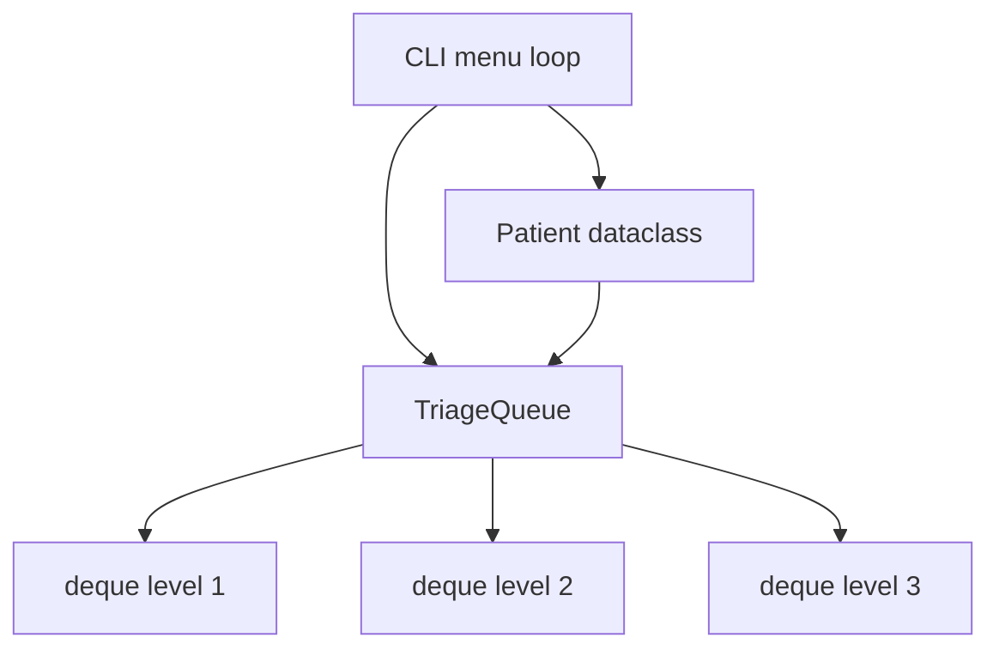

# Triage Queue — Priority Queue Manager — Reference Solution

This reference solution describes the expected architecture, implementation scope, and validation evidence for a complete submission. The deliverable is a **standalone terminal Python program** — no web UI, no external packages.

---

## Expected file layout

| File                             | Purpose                                                  |
| -------------------------------- | -------------------------------------------------------- |
| `triage_queue.py`                | Entry point: `Patient`, `TriageQueue`, and CLI menu loop |
| `DESIGN.md` (or inline comments) | Data-structure rationale and concurrent-mutation notes   |

---

## Architecture overview



**Separation rule:** queue logic lives in `TriageQueue`; the CLI only parses input and calls queue methods. No business logic in `main()` beyond menu dispatch.

---

## Data model — `Patient`

Minimum fields:

| Field          | Type       | Notes                                    |
| -------------- | ---------- | ---------------------------------------- |
| `name`         | `str`      | Patient identifier                       |
| `triage_level` | `int`      | 1 (critical), 2 (urgent), 3 (standard)   |
| `arrived_at`   | `datetime` | Set at enqueue time via `datetime.now()` |

Use `@dataclass` or a small class with `__repr__` for readable CLI output.

---

## `TriageQueue` — recommended internal design

**Three `collections.deque` instances** — one per triage level:

```python
from collections import deque

class TriageQueue:
    def __init__(self):
        self._queues = {1: deque(), 2: deque(), 3: deque()}
```

| Operation          | Behavior                                    | Complexity |
| ------------------ | ------------------------------------------- | ---------- |
| `enqueue(patient)` | `append` to `_queues[patient.triage_level]` | O(1)       |
| `dequeue()`        | Pop from lowest non-empty level (1 → 2 → 3) | O(1)       |
| `peek()`           | Inspect front of lowest non-empty level     | O(1)       |
| `list_queue()`     | Concatenate levels 1, 2, 3 in order         | O(n)       |
| `stats()`          | `{1: len(q1), 2: len(q2), 3: len(q3)}`      | O(1)       |

### Why three deques over alternatives

| Alternative                     | Drawback                                                                                                |
| ------------------------------- | ------------------------------------------------------------------------------------------------------- |
| Single `deque` + sort on insert | O(n log n) per insertion                                                                                |
| `heapq` alone                   | FIFO within same priority needs tie-breaker tuples `(level, counter, patient)` — valid but more complex |
| Sorted list                     | O(n) insert; unnecessary for three fixed priority bands                                                 |

Three deques give O(1) enqueue/dequeue with strict FIFO within each level and clear code for students.

### Empty queue handling

Raise a custom exception (e.g., `QueueEmptyError`) or return `None` with a clear message — **the CLI must catch it** and print a user-friendly message instead of crashing.

---

## CLI menu — expected behavior

```text
=== Triage Queue Manager ===
1. Add patient
2. Call next patient
3. View queue
4. Queue stats
5. Exit
Choice:
```

- Invalid menu input: re-prompt, do not crash.
- Invalid triage level: reject and re-prompt (only 1, 2, or 3).
- Option 2 on empty queue: print "No patients waiting" (or equivalent).

### Indicative session

```text
=== Triage Queue Manager ===
1. Add patient
2. Call next patient
3. View queue
4. Queue stats
5. Exit
Choice: 1
Name: Ana García
Triage level (1=critical, 2=urgent, 3=standard): 2
Patient Ana García added (level 2).

Choice: 1
Name: Luis Pérez
Triage level (1=critical, 2=urgent, 3=standard): 1
Patient Luis Pérez added (level 1).

Choice: 3
Waiting queue (attention order):
  1. Luis Pérez — level 1 — arrived 2025-06-26T10:01:00
  2. Ana García — level 2 — arrived 2025-06-26T10:00:30

Choice: 2
Calling: Luis Pérez (level 1)

Choice: 4
Queue stats: {1: 0, 2: 1, 3: 0}
```

---

## Design note — concurrent mutation

When two workers share the queue:

1. **Serialize mutations** with a lock (`threading.Lock` or DB row lock in production).
2. **Dequeue order:** acquire lock → read next patient → remove → release lock.
3. **Enqueue order:** acquire lock → append to correct deque → release lock.

A critical patient enqueued while another worker dequeues cannot be double-processed if dequeue is atomic under the lock. Document this informally in `DESIGN.md` — full distributed locking is out of scope.

---

## Validation evidence

A complete submission should demonstrate:

1. Level-1 patient placed ahead of waiting level-2 and level-3 patients.
2. Two level-2 patients attended in strict arrival order.
3. `dequeue()` / `peek()` on empty queue handled gracefully in CLI.
4. `list_queue()` returns patients in attention order (1s, then 2s, then 3s, FIFO within each).
5. `stats()` counts match visible queue contents.
6. `DESIGN.md` explains three-deque (or equivalent) choice with a concrete reason.
7. `DESIGN.md` addresses concurrent enqueue/dequeue scenario.

---

## Common mistakes (incomplete submissions)

- Sorting the entire queue on every `enqueue` call.
- Using a single FIFO `deque` — ignores triage priority.
- Logic dumped entirely in `main()` with no `TriageQueue` class.
- `peek()` mutates the queue (uses `popleft` instead of indexing `[0]`).
- External packages (`pip install`) when rubric requires stdlib only.
- No error handling for empty queue or invalid CLI input.

---

## Evaluation checklist

- [ ] `Patient` model with `name`, `triage_level`, `arrived_at`
- [ ] `TriageQueue` with all five operations implemented correctly
- [ ] Priority order: 1 before 2 before 3; FIFO within same level
- [ ] CLI menu functional with graceful error handling
- [ ] Design note on data-structure choice
- [ ] Design note on concurrent mutation scenario
- [ ] Stdlib only (`collections.deque`, `heapq`, `datetime`)
